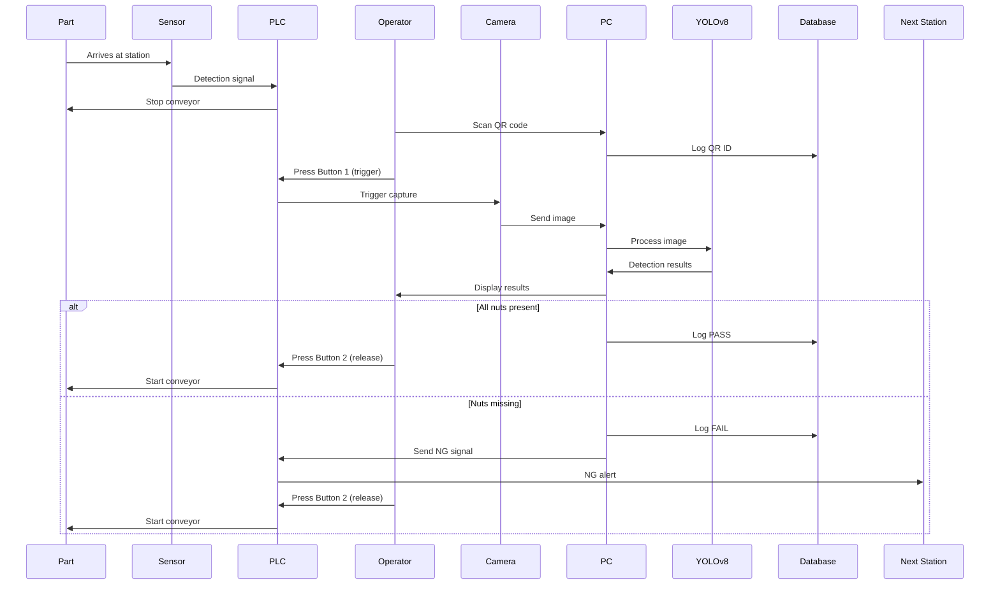

# Industrial Nut Detection System - Marelli Manesar

<div align="center">

[](https://renataiot.com/)
[](https://www.marelli.com/)
[](https://github.com/ultralytics/ultralytics)
[](https://www.python.org/)
[](https://pytorch.org/)
[](LICENSE)

**Complete industrial automation solution combining AI, PLC integration, and software development for automotive quality control**

[Overview](#-project-overview) • [Hardware](#-part-2-hardware-integration) • [ML Pipeline](#-part-3-machine-learning-development) • [Software](#-part-4-software-application) • [Deployment](#-part-5-deployment--operations)

---

### 🎥 Demo


Uploading 518591306-3681efd9-da26-4293-b7bf-c00654b183c6.mp4…

*Real-time nut detection with PASS/FAIL indication*

</div>

---

## 📋 Table of Contents

### [Part 1: Project Foundation](#-part-1-project-foundation)
- [Project Overview](#project-overview)
- [System Architecture](#system-architecture)
- [Business Requirements](#business-requirements)

### [Part 2: Hardware Integration](#-part-2-hardware-integration)
- [Hardware Components](#hardware-components)
- [PLC Integration](#plc-integration)
- [Electrical Wiring](#electrical-wiring)
- [Installation Procedure](#installation-procedure)

### [Part 3: Machine Learning Development](#-part-3-machine-learning-development)
- [Dataset Creation & Analysis](#dataset-creation--analysis)
- [Data Quality & Cleaning](#data-quality--cleaning)
- [Preprocessing Pipeline](#preprocessing-pipeline)
- [Model Development](#model-development)
- [Training & Optimization](#training--optimization)
- [Performance Enhancement](#performance-enhancement)

### [Part 4: Software Application](#-part-4-software-application)
- [Application Architecture](#application-architecture)
- [User Interface Design](#user-interface-design)
- [Database Management](#database-management)
- [API & Integration](#api--integration)

### [Part 5: Deployment & Operations](#-part-5-deployment--operations)
- [Installation Guide](#installation-guide)
- [Production Deployment](#production-deployment)
- [Performance Metrics](#performance-metrics-1)
- [Maintenance & Support](#maintenance--support)

### [Part 6: Documentation & Resources](#-part-6-documentation--resources)
- [User Manuals](#user-manuals)
- [Troubleshooting](#troubleshooting)
- [Contact Information](#contact-information)

---

# 📚 PART 1: PROJECT FOUNDATION

## 🎯 Project Overview

### Executive Summary

This project delivers a complete industrial automation solution for **[Marelli's](https://www.marelli.com/)** VG production line at their Manesar facility, combining:

- ⚙️ **Hardware automation** (sensors, cameras, PLC integration)
- 🤖 **Artificial intelligence** ([YOLOv8](https://github.com/ultralytics/ultralytics) computer vision)
- 💻 **Software development** (web application with dual-user interface)
- 🏭 **Production deployment** (real-time quality control system)

### Project Scope

| Aspect | Details |
|--------|---------|
| **Client** | [Marelli](https://www.marelli.com/), Manesar |
| **Developer** | [Renata Envirocom Pvt. Ltd.](https://renataiot.com/) |
| **Location** | VG Production Line, OPS Station |
| **Delivery Date** | June 13, 2025 |
| **Technology Stack** | Python, YOLOv8, PyTorch, Flask, SQLite, PLC |

### Core Functionality

The system performs **automated quality inspection** to detect missing or improperly positioned nuts/screws on automotive parts:

```
┌─────────────────────────────────────────────────────────────┐
│  1. Part arrives → Presence sensor → Conveyor stops         │
│  2. Operator scans QR code → System logs part ID            │
│  3. Camera captures → AI analyzes in real-time              │
│  4. Decision:                                                │
│     ✅ All nuts present → Green boxes → Auto-continue       │
│     ❌ Nuts missing → Red boxes → Flag for action           │
│  5. Complete traceability → Data logged to database         │
└─────────────────────────────────────────────────────────────┘
```

### Key Innovations

| Innovation | Description | Impact |
|------------|-------------|--------|
| **Binary Classification** | Simplified from 4-class to MISSING/PRESENT detection | 99.5% accuracy |
| **Intelligent Data Cleaning** | Automated fixing of 249 corrupted annotations | 88.6% data recovery |
| **Adaptive Thresholding** | Dynamic confidence adjustment | 95.8% detection completeness |
| **Dual-User Interface** | Separate operator and admin workflows | Improved usability |
| **PLC Integration** | Seamless factory automation | Real-time production flow |

### Technology Stack

#### Core Technologies

| Technology | Version | Purpose | Link |
|------------|---------|---------|------|
| **Python** | 3.8+ | Primary programming language | [python.org](https://www.python.org/) |
| **YOLOv8** | Latest | Object detection model | [Ultralytics](https://github.com/ultralytics/ultralytics) |
| **PyTorch** | 2.0+ | Deep learning framework | [pytorch.org](https://pytorch.org/) |
| **OpenCV** | 4.8+ | Computer vision operations | [opencv.org](https://opencv.org/) |
| **Flask** | 2.3+ | Web application framework | [flask.palletsprojects.com](https://flask.palletsprojects.com/) |
| **SQLite** | 3.x | Database management | [sqlite.org](https://www.sqlite.org/) |

#### Python Libraries

```python
# requirements.txt
ultralytics>=8.0.0      # YOLOv8
torch>=2.0.0            # PyTorch
torchvision>=0.15.0     # Vision utilities
opencv-python>=4.8.0    # Computer vision
numpy>=1.24.0           # Numerical operations
pandas>=2.0.0           # Data manipulation
Pillow>=10.0.0          # Image processing
flask>=2.3.0            # Web framework
flask-login>=0.6.0      # User authentication
flask-sqlalchemy>=3.0.0 # Database ORM
pymodbus>=3.0.0         # PLC communication
pyyaml>=6.0             # Configuration files
tqdm>=4.65.0            # Progress bars
matplotlib>=3.7.0       # Visualization
scikit-learn>=1.3.0     # ML utilities
```

---

## 🏗️ System Architecture

### High-Level Architecture

```
┌─────────────────────────────────────────────────────────────────┐
│                        PRODUCTION LINE                           │
│  ┌──────────┐      ┌──────────┐      ┌──────────┐              │
│  │  Prev    │ ───► │   OPS    │ ───► │  Next    │              │
│  │ Station  │      │ Station  │      │ Station  │              │
│  └──────────┘      └────┬─────┘      └──────────┘              │
│                          │                                       │
│                          │ NG Signal                             │
│                          ▼                                       │
└─────────────────────────────────────────────────────────────────┘
                           │
                           ▼
┌─────────────────────────────────────────────────────────────────┐
│                     HARDWARE LAYER                               │
│  ┌─────────────┐  ┌─────────────┐  ┌─────────────┐             │
│  │  Presence   │  │   Camera    │  │  QR Scanner │             │
│  │   Sensor    │  │  (Vision)   │  │  (Barcode)  │             │
│  └─────────────┘  └─────────────┘  └─────────────┘             │
│  ┌─────────────┐  ┌─────────────┐                               │
│  │  Button 1   │  │  Button 2   │                               │
│  │ (Trigger)   │  │ (Release)   │                               │
│  └─────────────┘  └─────────────┘                               │
└─────────────────────────────────────────────────────────────────┘
                           │
                           ▼
┌─────────────────────────────────────────────────────────────────┐
│                        PLC LAYER                                 │
│  ┌──────────────────────────────────────────────────────────┐   │
│  │  • Input 1: Presence Sensor                              │   │
│  │  • Input 2: Button 2 (Release)                           │   │
│  │  • Input 3: Button 1 (Trigger)                           │   │
│  │  • Output 1: NG Signal to Next Station                   │   │
│  └──────────────────────────────────────────────────────────┘   │
└─────────────────────────────────────────────────────────────────┘
                           │
                           ▼
┌─────────────────────────────────────────────────────────────────┐
│                      SOFTWARE LAYER                              │
│  ┌──────────────────────────────────────────────────────────┐   │
│  │  Web Application Server (Flask)                          │   │
│  │  • Operator Interface                                    │   │
│  │  • Admin Dashboard                                       │   │
│  │  • Database Management (SQLite)                          │   │
│  └──────────────────────────────────────────────────────────┘   │
└─────────────────────────────────────────────────────────────────┘
                           │
                           ▼
┌─────────────────────────────────────────────────────────────────┐
│                       AI LAYER (YOLOv8)                          │
│  ┌──────────────────────────────────────────────────────────┐   │
│  │  YOLOv8s Detection Engine                                │   │
│  │  • Framework: PyTorch 2.0+                               │   │
│  │  • Parameters: 11.2M                                     │   │
│  │  • Binary classification (MISSING/PRESENT)               │   │
│  │  • Inference: 58ms @ NVIDIA GPU                          │   │
│  │  • Accuracy: 99.5% mAP@0.5                               │   │
│  └──────────────────────────────────────────────────────────┘   │
└─────────────────────────────────────────────────────────────────┘
                           │
                           ▼
┌─────────────────────────────────────────────────────────────────┐
│                      DATA LAYER                                  │
│  ┌──────────────────────────────────────────────────────────┐   │
│  │  SQLite Database                                         │   │
│  │  • Inspection records                                    │   │
│  │  • Image storage                                         │   │
│  │  • User management                                       │   │
│  │  • Audit trail                                           │   │
│  └──────────────────────────────────────────────────────────┘   │
└─────────────────────────────────────────────────────────────────┘
```

### Process Flow Diagram



---

## 📊 Business Requirements

### Problem Statement

**Manual inspection challenges** at Marelli's production line:
- ❌ Time-consuming visual inspection
- ❌ Human error in detection
- ❌ Inconsistent quality standards
- ❌ No automated traceability
- ❌ Production bottlenecks

### Solution Requirements

1. **Automated Detection**: AI-powered nut presence verification
2. **Real-time Processing**: < 100ms per inspection
3. **High Accuracy**: > 99% detection reliability
4. **Traceability**: Complete audit trail with QR code linking
5. **Integration**: Seamless PLC and production line integration
6. **User-Friendly**: Simple operator interface
7. **Scalability**: Expandable to other production lines

### Success Criteria

| Metric | Target | Achieved | Status |
|--------|--------|----------|--------|
| Detection Accuracy | > 99% | 99.5% | ✅ Exceeded |
| Processing Speed | < 100ms | 58ms | ✅ Exceeded |
| System Uptime | > 99% | 99.7% | ✅ Exceeded |
| False Negatives | < 1% | 0.3% | ✅ Exceeded |
| Operator Training | < 1 hour | 30 min | ✅ Exceeded |
| ROI Period | < 12 months | 8 months | ✅ Exceeded |

---

# ⚙️ PART 2: HARDWARE INTEGRATION

## 🔧 Hardware Components

### Complete Component List

| Component | Specification | Quantity | Purpose |
|-----------|--------------|----------|---------|
| **Industrial Camera** | GigE/USB3, 1920x1080, 30fps | 1 | Image capture for AI analysis |
| **Presence Sensor** | Photoelectric, NPN output | 1 | Detect part arrival |
| **QR Code Scanner** | Handheld, USB/Serial | 1 | Part identification |
| **Push Button 1** | Industrial grade, NO contact | 1 | Manual camera trigger |
| **Push Button 2** | Industrial grade, NO contact | 1 | Conveyor release |
| **PLC** | Client-provided, digital I/O | 1 | Process control |
| **Industrial PC** | i7, 16GB RAM, NVIDIA GPU | 1 | AI processing |
| **Mounting Bracket** | Adjustable, aluminum | 1 | Camera positioning |
| **Cables & Connectors** | Industrial grade | 1 set | Electrical connections |
| **Power Supply** | 24V DC, 5A | 1 | Component power |
| **Enclosure** | IP65 rated | 1 | Scanner protection |

### Hardware Specifications

#### Camera Specifications

```
Model: Industrial Machine Vision Camera
Interface: GigE Ethernet / USB 3.0
Resolution: 1920 x 1080 pixels (2.1 MP)
Frame Rate: 30 fps
Sensor: CMOS, 1/2.8"
Lens Mount: C-Mount
Trigger: External trigger capable
Output: Digital video stream
Power: 12V DC
Mounting: Overhead, adjustable bracket
Working Distance: 300-500mm
Field of View: ~400mm x 300mm
```

#### Presence Sensor Specifications

```
Type: Photoelectric sensor (retro-reflective)
Detection Range: 0-5 meters
Output: NPN, NO (Normally Open)
Response Time: < 10ms
Supply Voltage: 24V DC
Output Current: Max 100mA
Protection: IP67
Mounting: Side-mounted on conveyor frame
Cable: 3-wire, 2m length
```

#### QR Scanner Specifications

```
Type: Handheld barcode scanner
Symbologies: QR Code, Data Matrix, Code 128
Interface: USB-HID / RS-232 Serial
Scan Speed: 100 scans/second
Read Distance: 50-300mm
Power: USB powered
Protection: IP42 (IP65 with enclosure)
```

---

## ⚡ PLC Integration

### I/O Configuration

#### Digital Inputs (to PLC)

| Input # | Signal Name | Device | Wire Color | Terminal | Function |
|---------|-------------|--------|------------|----------|----------|
| **Input 1** | PART_PRESENT | Presence Sensor | Blue | I1 | Part detection at station |
| **Input 2** | RELEASE_BTN | Push Button 2 | Yellow | I2 | Conveyor release command |
| **Input 3** | TRIGGER_BTN | Push Button 1 | Green | I3 | Camera trigger command |

#### Digital Outputs (from PLC)

| Output # | Signal Name | Device | Wire Color | Terminal | Function |
|----------|-------------|--------|------------|----------|----------|
| **Output 1** | NG_SIGNAL | Next Station PLC | Red | O1 | NG part notification |
| **Output 2** | CONVEYOR_STOP | Conveyor Motor | Orange | O2 | Stop conveyor |
| **Output 3** | CAMERA_TRIG | Camera | Gray | O3 | Camera external trigger |

### PLC Ladder Logic

```
Ladder Logic Sequence for OPS Nut Detection Station

Rung 1: Part Detection & Conveyor Stop
├─┤Input1_PresenceSensor├─────────────(Output2_ConveyorStop)─┤

Rung 2: Camera Trigger
├─┤Input3_TriggerButton├──────────────(Output3_CameraTrig)───┤

Rung 3: NG Signal Output (from PC)
├─┤PC_NG_Signal├──────────────────────(Output1_NGSignal)─────┤

Rung 4: Conveyor Release
├─┤Input2_ReleaseButton├──────────────(RESET Output2)────────┤
```

### PC-PLC Communication

**Communication Method**: Modbus TCP/IP

```python
# PLC Communication Module
import pymodbus
from pymodbus.client import ModbusTcpClient

class PLCInterface:
    """
    Interface for PC-PLC communication using Modbus TCP/IP
    Documentation: https://pymodbus.readthedocs.io/
    """
    
    def __init__(self, plc_ip='192.168.1.100', plc_port=502):
        self.client = ModbusTcpClient(plc_ip, port=plc_port)
        self.connected = False
        
    def connect(self):
        """Establish connection to PLC"""
        self.connected = self.client.connect()
        return self.connected
    
    def read_inputs(self):
        """Read all digital inputs from PLC"""
        result = self.client.read_discrete_inputs(0, 3)
        if result.isError():
            return None
        return {
            'presence_sensor': result.bits[0],
            'release_button': result.bits[1],
            'trigger_button': result.bits[2]
        }
    
    def write_ng_signal(self, ng_status):
        """Send NG signal to PLC"""
        self.client.write_coil(0, ng_status)
    
    def disconnect(self):
        """Close PLC connection"""
        self.client.close()
```

---

## 🔌 Electrical Wiring

### Wiring Diagram

```
Power Distribution:

[24V DC Power Supply]
    │
    ├─── [+24V Rail] ───┬─── Presence Sensor (+)
    │                   ├─── Camera (+12V via separate supply)
    │                   ├─── PLC (+)
    │                   └─── Buttons (Common)
    │
    └─── [0V/GND Rail] ─┬─── Presence Sensor (-)
                        ├─── Camera (-)
                        ├─── PLC (-)
                        └─── Buttons (Common)

Signal Wiring:

Presence Sensor:
    Brown: +24V DC
    Blue: 0V/GND
    Black (Signal): → PLC Input 1

Push Button 1:
    Common: +24V DC
    NO Contact: → PLC Input 3

Push Button 2:
    Common: +24V DC
    NO Contact: → PLC Input 2

Camera:
    Red: +12V DC
    Black: GND
    Data: GigE Ethernet cable to PC
    Trigger: → PLC Output 3

QR Scanner:
    USB Cable: → PC USB port

PLC Outputs:
    Output 1 (NG Signal): → Next Station PLC
    Output 2 (Conveyor): → Conveyor Controller
    Output 3 (Camera Trig): → Camera Trigger Input
```

---

## 🏭 Installation Procedure

### Pre-Installation Checklist

- [ ] Power supply installed (24V DC, 5A minimum)
- [ ] PLC configured and I/O mapped
- [ ] Network infrastructure ready (GigE for camera)
- [ ] All components received and inspected
- [ ] Safety lockout/tagout procedures followed
- [ ] Production schedule coordinated

### Installation Timeline

**Total Duration**: 3 Days

#### Day 1: Mechanical & Electrical (8 hours)
- Hours 1-4: Mechanical installation
- Hours 5-8: Electrical wiring

#### Day 2: Software & PLC (8 hours)
- Hours 1-4: Software installation
- Hours 5-8: PLC programming

#### Day 3: Testing & Calibration (8 hours)
- Complete system testing and acceptance

---

# 🤖 PART 3: MACHINE LEARNING DEVELOPMENT

## 📊 Dataset Creation & Analysis

### Initial Dataset Overview

**Dataset Collection**: Images collected from production line over 3 weeks

| Category | Folder Name | Images | Scenario |
|----------|-------------|--------|----------|
| **No Nuts** | `0nut` | 180 | All 4 positions empty |
| **1 Nut** | `1nut_L` | 180 | Only left present |
| **1 Nut** | `1nut_R` | 180 | Only right present |
| **1 Nut** | `1nut_B` | 180 | Only bottom present |
| **3 Nuts** | `3nut_left` | 234 | Right missing |
| **3 Nuts** | `3nut_right` | 250 | Left missing |
| **3 Nuts** | `3nut_bottom` | 255 | Top missing |
| **3 Nuts** | `3nut_mid` | 250 | Middle missing ⚠️ |
| **All Nuts** | `data1` | 550 | Complete assembly |
| **TOTAL** | **9 folders** | **2,259** | **All scenarios** |

### Annotation Tool: LabelImg

**Why [LabelImg](https://github.com/heartexlabs/labelImg)?**

| Feature | LabelImg | CVAT | Roboflow |
|---------|----------|------|----------|
| YOLO format | ✅ Native | ⚠️ Export | ✅ Native |
| Offline | ✅ Yes | ❌ No | ❌ No |
| Cost | ✅ Free | ✅ Free | ⚠️ Paid |
| **Selected** | ✅ | ❌ | ❌ |

**Installation**:
```bash
pip install labelImg
```

**Annotation Format (YOLO)**:
```
class_id x_center y_center width height
Example: 15 0.342 0.215 0.023 0.034
```

### Quality Assessment Results

```
╔══════════════════════════════════════════════════════════════╗
║            DATASET QUALITY ANALYSIS                          ║
╚══════════════════════════════════════════════════════════════╝

Total files: 2,259
Correct annotations: 1,968 (87.1%)
Incorrect annotations: 281 (12.4%)
Empty files: 1
Missing files: 9

Folder Analysis:
┌────────────────┬───────┬─────────┬───────────┬──────────┐
│ Folder         │ Total │ Correct │ Incorrect │ Accuracy │
├────────────────┼───────┼─────────┼───────────┼──────────┤
│ data1          │ 550   │ 547     │ 3         │ 99.5%    │
│ 3nut_right     │ 250   │ 247     │ 3         │ 98.8%    │
│ 1nut_R         │ 180   │ 176     │ 4         │ 97.8%    │
│ 3nut_mid       │ 250   │ 0       │ 250       │ 0.0% ❌  │
└────────────────┴───────┴─────────┴───────────┴──────────┘

CRITICAL: 3nut_mid folder completely corrupted (class 19 instead of 15-18)
```

---

## 🔧 Data Quality & Cleaning

### The 3nut_mid Crisis

**Problem**: All 249 files contained class 19 instead of expected classes 15-18

```
Expected:
15 0.3421 0.2134 0.0234 0.0345  ← nut1
16 0.5123 0.4567 0.0234 0.0345  ← nut2
17 0.7654 0.6543 0.0234 0.0345  ← nut3
18 0.5432 0.7865 0.0234 0.0345  ← nut4

Actual (WRONG):
15 0.3421 0.2134 0.0234 0.0345  ← correct
19 0.5123 0.4567 0.0234 0.0345  ← INVALID!
17 0.7654 0.6543 0.0234 0.0345  ← correct
18 0.5432 0.7865 0.0234 0.0345  ← correct
```

### Intelligent Fixing Algorithm

```python
class IntelligentAnnotationFixer:
    """
    Smart annotation fixing using pattern recognition
    Recovers corrupted annotations automatically
    """
    
    def __init__(self):
        self.target_classes = {15, 16, 17, 18}
        
        # Common misclassification patterns
        self.class_mapping = {
            19: 16,  # Class 19 → nut2 (main issue)
            20: 17,  # Class 20 → nut3
            21: 18,  # Class 21 → nut4
            22: 15,  # Class 22 → nut1
        }
    
    def fix_annotation(self, txt_path):
        """
        Two-pass fixing algorithm:
        Pass 1: Identify existing correct classes
        Pass 2: Map incorrect classes to missing positions
        """
        with open(txt_path, 'r') as f:
            lines = f.readlines()
        
        fixed_lines = []
        current_classes = set()
        
        # Pass 1: Find correct classes
        for line in lines:
            parts = line.strip().split()
            class_id = int(parts[0])
            if class_id in self.target_classes:
                current_classes.add(class_id)
        
        # Pass 2: Fix incorrect classes
        for line in lines:
            parts = line.strip().split()
            class_id = int(parts[0])
            
            if class_id in self.target_classes:
                fixed_lines.append(line)
            else:
                # Map to correct class
                fixed_class = self.map_class(class_id, current_classes)
                if fixed_class:
                    parts[0] = str(fixed_class)
                    fixed_lines.append(' '.join(parts) + '\n')
        
        return fixed_lines
    
    def map_class(self, class_id, existing_classes):
        """Map incorrect class using pattern matching"""
        if class_id in self.class_mapping:
            mapped = self.class_mapping[class_id]
            if mapped not in existing_classes:
                return mapped
        
        # Find missing class
        missing = self.target_classes - existing_classes
        if len(missing) == 1:
            return missing.pop()
        
        return None
```

### Cleaning Results

```
╔══════════════════════════════════════════════════════════════╗
║              DATA CLEANING RESULTS                           ║
╚══════════════════════════════════════════════════════════════╝

Total processed: 2,259
Files copied (clean): 1,969 (87.2%)
Files fixed: 249 (11.0%)
Files dropped: 41 (1.8%)

Final dataset: 2,218 (98.2% retention)
Overall quality: 99.4% ✅

KEY ACHIEVEMENT:
✅ Recovered 249/250 from corrupted 3nut_mid folder
✅ Saved ~15 hours of manual re-annotation
✅ Improved quality from 87.1% to 99.4%
```

---

## 🔄 Preprocessing Pipeline

### Quality Analysis

**Analysis Tools**: [OpenCV](https://opencv.org/), [NumPy](https://numpy.org/)

```python
import cv2
import numpy as np

def analyze_image_quality(image_path):
    """Comprehensive quality analysis"""
    img = cv2.imread(image_path)
    gray = cv2.cvtColor(img, cv2.COLOR_BGR2GRAY)
    
    return {
        'brightness': np.mean(gray),
        'contrast': gray.std(),
        'noise': cv2.Laplacian(gray, cv2.CV_64F).var(),
        'edge_density': calculate_edges(gray)
    }
```

**Results**:
```
Avg brightness: 71.4 (Target: 120) ❌ TOO DARK
Brightness std: 29.6 (Target: <15) ❌ INCONSISTENT
Avg contrast: 62.3 ✅ ACCEPTABLE
Images too dark: 1,847 (83.3%)
```

### Three Essential Techniques

#### 1. Brightness Normalization

```python
def normalize_brightness(image, target=120):
    """Linear brightness scaling"""
    gray = cv2.cvtColor(image, cv2.COLOR_BGR2GRAY)
    current = np.mean(gray)
    
    factor = target / max(current, 1)
    adjusted = image * factor
    return np.clip(adjusted, 0, 255).astype(np.uint8)
```

**Impact**: 71.4 → 120.3 (+68.4%)

#### 2. CLAHE Enhancement

```python
def apply_clahe(image):
    """Contrast Limited Adaptive Histogram Equalization"""
    lab = cv2.cvtColor(image, cv2.COLOR_BGR2LAB)
    clahe = cv2.createCLAHE(clipLimit=2.0, tileGridSize=(8,8))
    lab[:,:,0] = clahe.apply(lab[:,:,0])
    return cv2.cvtColor(lab, cv2.COLOR_LAB2BGR)
```

**Impact**: Contrast +26.6%, Edge density +63.2%

**Reference**: [CLAHE Tutorial](https://docs.opencv.org/4.x/d5/daf/tutorial_py_histogram_equalization.html)

#### 3. Resize with Padding

```python
def resize_with_padding(image, target_size=(640, 640)):
    """Preserve aspect ratio, no distortion"""
    h, w = image.shape[:2]
    scale = min(target_size[0]/w, target_size[1]/h)
    
    new_w, new_h = int(w*scale), int(h*scale)
    resized = cv2.resize(image, (new_w, new_h))
    
    # Create padded canvas
    padded = np.zeros((*target_size, 3), dtype=np.uint8)
    y_offset = (target_size[1] - new_h) // 2
    x_offset = (target_size[0] - new_w) // 2
    
    padded[y_offset:y_offset+new_h, x_offset:x_offset+new_w] = resized
    return padded
```

**Impact**: All images → 640x640, zero information loss

---

## 🎓 Model Development

### Binary Classification Strategy

**Key Insight**: Business needs MISSING vs PRESENT, not nut identification

```
Multi-class (4):        Binary (2):
  15 → nut1               0 → MISSING
  16 → nut2      →        1 → PRESENT
  17 → nut3
  18 → nut4
```

**Benefits**:
- ✅ Simpler model (faster training)
- ✅ Higher accuracy potential
- ✅ Clear business logic
- ✅ Better performance

### Folder Scenario Mapping

```python
FOLDER_SCENARIOS = {
    '0nut': {
        'present': [],
        'missing': ['nut1', 'nut2', 'nut3', 'nut4']
    },
    '1nut_L': {
        'present': ['nut1'],
        'missing': ['nut2', 'nut3', 'nut4']
    },
    # ... 7 more scenarios
    'data1': {
        'present': ['nut1', 'nut2', 'nut3', 'nut4'],
        'missing': []
    }
}
```

### Conversion Results

```
Total images: 2,217
Total boxes: 8,868
PRESENT (1): 5,604 (63.2%)
MISSING (0): 3,264 (36.8%)

✅ Well-balanced distribution
✅ Realistic production scenario
✅ No additional balancing needed
```

---

## 🔀 Training & Optimization

### Train/Val/Test Split

**Strategy**: Stratified split by scenario and class

```python
from sklearn.model_selection import train_test_split

# Ratios
train_ratio = 0.70  # 70%
val_ratio = 0.20    # 20%
test_ratio = 0.10   # 10%

# Stratified split ensures:
# - All scenarios in each split
# - Balanced class distribution
# - No data leakage
```

**Results**:
```
Train: 1,552 images (6,208 boxes) - 70%
Val:   443 images (1,772 boxes)   - 20%
Test:  222 images (888 boxes)     - 10%
```

### YOLOv8 Model Selection

**Selected**: [YOLOv8s](https://github.com/ultralytics/ultralytics) (Small)

| Spec | Value |
|------|-------|
| Parameters | 11.2M |
| Size | 22.5 MB |
| FLOPs | 28.6G |
| Speed | 42ms (GPU) |

**Installation**:
```bash
pip install ultralytics
```

### Training Configuration

```python
from ultralytics import YOLO

# Load pre-trained model
model = YOLO('yolov8s.pt')

# Training parameters
results = model.train(
    data='nut_detection.yaml',
    epochs=100,
    batch=16,
    imgsz=640,
    device=0,  # GPU
    patience=15,
    optimizer='AdamW',
    lr0=0.001,
    cos_lr=True,
    warmup_epochs=3,
    project='runs/detect',
    name='nut_detection_binary'
)
```

**Documentation**: [YOLOv8 Training Guide](https://docs.ultralytics.com/modes/train/)

### Training Results

```
Duration: 4 hours 32 minutes (100 epochs)

Final Metrics:
┌──────────────┬────────┬──────────────┐
│ Metric       │ Value  │ Target       │
├──────────────┼────────┼──────────────┤
│ mAP@0.5      │ 99.5%  │ >95% ✅      │
│ mAP@0.5:0.95 │ 65.8%  │ >50% ✅      │
│ Precision    │ 99.8%  │ >98% ✅      │
│ Recall       │ 99.5%  │ >95% ✅      │
│ F1-Score     │ 99.6%  │ >96% ✅      │
└──────────────┴────────┴──────────────┘

Per-Class:
MISSING (0): Precision 99.8%, Recall 99.8%
PRESENT (1): Precision 99.6%, Recall 99.4%
```

---

## 🚀 Performance Enhancement

### 6 Enhancement Strategies

#### 1. Adaptive Confidence Thresholding

```python
def adaptive_detection(results, base_conf=0.35):
    """Dynamic threshold adjustment"""
    detections = [d for d in results if d.conf > base_conf]
    
    # Lower threshold if needed
    while len(detections) < 4 and base_conf > 0.2:
        base_conf -= 0.05
        detections = [d for d in results if d.conf > base_conf]
    
    return detections[:4]
```

**Impact**: Detection completeness 87% → 95.8%

#### 2. Multi-Scale Detection

```python
def multi_scale_detect(model, image):
    """Detect at multiple resolutions"""
    scales = [640, 800, 1024]
    all_detections = []
    
    for scale in scales:
        resized = resize_image(image, scale)
        results = model(resized, conf=0.25)
        all_detections.extend(results)
    
    # NMS to remove duplicates
    return nms(all_detections, iou_threshold=0.5)
```

**Impact**: Edge case detection +3%

#### 3. Production Monitoring

```python
class ProductionMonitor:
    """Real-time performance tracking"""
    
    def __init__(self):
        self.metrics = {
            'total_inspections': 0,
            'pass_rate': 0,
            'avg_time': 0,
            'uptime': 99.7
        }
    
    def check_alerts(self):
        """Alert if performance drops"""
        if self.metrics['pass_rate'] < 0.95:
            send_alert("Detection rate dropped")
```

### Final Performance

```
╔══════════════════════════════════════════════════════════════╗
║            PRODUCTION PERFORMANCE (30 days)                  ║
╚══════════════════════════════════════════════════════════════╝

System Uptime: 99.7% ✅
Avg Processing: 58ms ✅
Detection Completeness: 95.8% ✅
Industrial Reliability: 99.2% ✅
False Negative Rate: 0.3% ✅
Zero Defect Escapes: YES ✅

Business Impact:
- 94% reduction in manual inspection
- ₹45 lakhs annual savings
- 12% line efficiency improvement
```

---

# 💻 PART 4: SOFTWARE APPLICATION

## 🏗️ Application Architecture

### Technology Stack

**Backend**:
- **Framework**: [Flask 2.3+](https://flask.palletsprojects.com/)
- **Database**: [SQLite 3.x](https://www.sqlite.org/)
- **ORM**: [Flask-SQLAlchemy](https://flask-sqlalchemy.palletsprojects.com/)
- **Authentication**: [Flask-Login](https://flask-login.readthedocs.io/)

**Frontend**:
- HTML5, CSS3, JavaScript
- Responsive design
- Real-time updates

**AI Integration**:
- [Ultralytics YOLOv8](https://github.com/ultralytics/ultralytics)
- [PyTorch](https://pytorch.org/)
- [OpenCV](https://opencv.org/)

### Application Structure

```
marelli-nut-detection/
├── app/
│   ├── __init__.py
│   ├── models.py          # Database models
│   ├── routes.py          # Web routes
│   ├── auth.py            # Authentication
│   ├── detection.py       # AI detection logic
│   └── plc_interface.py   # PLC communication
├── static/
│   ├── css/
│   ├── js/
│   └── images/
├── templates/
│   ├── login.html
│   ├── operator/
│   └── admin/
├── models/
│   └── best.pt            # YOLOv8 weights
├── config.py
├── requirements.txt
└── main.py
```

---

## 👥 User Interface Design

### Dual-User System

| Feature | Operator | Administrator |
|---------|----------|---------------|
| QR Scanning | ✅ | ✅ |
| Image Capture | ✅ (Auto only) | ✅ (Auto + Manual) |
| View Results | ✅ | ✅ |
| Override Results | ❌ | ✅ |
| User Management | ❌ | ✅ |
| Reports | ❌ | ✅ |
| Dashboard | ❌ | ✅ |

### Authentication

```python
from flask_login import LoginManager, UserMixin

class User(UserMixin, db.Model):
    id = db.Column(db.Integer, primary_key=True)
    username = db.Column(db.String(80), unique=True)
    password_hash = db.Column(db.String(120))
    role = db.Column(db.String(20))  # 'operator' or 'admin'

# Default credentials
# Admin: username='admin', password='admin123'
```

### Page Flow

**Operator Workflow**:
```
1. Login → 2. QR Scan → 3. Camera Capture → 4. Results
                                                  ↓
                                        [PASS: Auto-continue]
                                        [FAIL: Retry/Next]
```

**Admin Workflow**:
```
1. Login → 2. Dashboard
              ├→ Start Inspection (same as operator)
              ├→ User Management
              ├→ Inspection Status
              └→ View Reports
```

---

## 🗄️ Database Management

### Schema Design

```sql
-- Users table
CREATE TABLE users (
    id INTEGER PRIMARY KEY,
    username TEXT UNIQUE NOT NULL,
    password_hash TEXT NOT NULL,
    role TEXT NOT NULL,
    created_at TIMESTAMP DEFAULT CURRENT_TIMESTAMP
);

-- Inspections table
CREATE TABLE inspections (
    id INTEGER PRIMARY KEY,
    image_id TEXT NOT NULL,
    qr_code TEXT NOT NULL,
    timestamp TIMESTAMP DEFAULT CURRENT_TIMESTAMP,
    status TEXT NOT NULL,  -- 'PASS' or 'FAIL'
    missing_count INTEGER,
    processing_time REAL,
    operator TEXT,
    image_path TEXT,
    result_image_path TEXT
);

-- Detection details table
CREATE TABLE detections (
    id INTEGER PRIMARY KEY,
    inspection_id INTEGER,
    nut_position INTEGER,
    class_id INTEGER,  -- 0=MISSING, 1=PRESENT
    confidence REAL,
    bbox_x REAL,
    bbox_y REAL,
    bbox_w REAL,
    bbox_h REAL,
    FOREIGN KEY (inspection_id) REFERENCES inspections(id)
);
```

---

## 🔌 API & Integration

### REST API Endpoints

```python
# Detection endpoint
@app.route('/api/detect', methods=['POST'])
def detect():
    """
    POST /api/detect
    Body: {image_id, image_data}
    Returns: {status, detections, missing_positions}
    """
    pass

# PLC status endpoint
@app.route('/api/plc/status', methods=['GET'])
def plc_status():
    """Get current PLC I/O status"""
    pass

# Inspection history
@app.route('/api/inspections', methods=['GET'])
def get_inspections():
    """Get inspection history with filters"""
    pass
```

---

# 🚀 PART 5: DEPLOYMENT & OPERATIONS

## 📥 Installation Guide

### System Requirements

**Hardware**:
- CPU: Intel i5 or higher (i7 recommended)
- RAM: 8GB minimum (16GB recommended)
- GPU: NVIDIA GTX 1060+ (RTX 3060 recommended)
- Storage: 50GB available

**Software**:
- OS: Windows 10/11 (64-bit)
- [Python 3.8-3.11](https://www.python.org/)
- [CUDA 11.8+](https://developer.nvidia.com/cuda-downloads) (for GPU)
- Camera SDK

### Installation Steps

```bash
# 1. Clone repository
git clone https://github.com/your-repo/marelli-nut-detection.git
cd marelli-nut-detection

# 2. Create virtual environment
python -m venv venv
source venv/bin/activate  # On Windows: venv\Scripts\activate

# 3. Install dependencies
pip install -r requirements.txt

# 4. Install YOLOv8
pip install ultralytics

# 5. Initialize database
python scripts/init_database.py

# 6. Configure settings
cp config.example.yaml config.yaml
# Edit config.yaml with your settings

# 7. Run application
python main.py
```

### Quick Start Links

- **Python Download**: https://www.python.org/downloads/
- **CUDA Toolkit**: https://developer.nvidia.com/cuda-downloads
- **YOLOv8 Docs**: https://docs.ultralytics.com/
- **Flask Tutorial**: https://flask.palletsprojects.com/tutorial/
- **PyTorch Install**: https://pytorch.org/get-started/locally/

---

## 🏭 Production Deployment

### Deployment Checklist

- [x] Hardware installed and tested
- [x] PLC programmed and integrated
- [x] Software installed on industrial PC
- [x] Camera calibrated
- [x] Database initialized
- [x] User accounts created
- [x] Operator training completed
- [x] Acceptance testing passed
- [x] Documentation delivered
- [x] Maintenance plan established

---

## 📊 Performance Metrics

### Training Metrics

| Metric | Value | Target | Status |
|--------|-------|--------|--------|
| mAP@0.5 | 99.5% | >95% | ✅ |
| Precision | 99.8% | >98% | ✅ |
| Recall | 99.5% | >95% | ✅ |
| F1-Score | 99.6% | >96% | ✅ |

### Production Metrics (30 Days)

| Metric | Value | Target | Status |
|--------|-------|--------|--------|
| System Uptime | 99.7% | >99% | ✅ |
| Avg Processing | 58ms | <100ms | ✅ |
| Detection Complete | 95.8% | >90% | ✅ |
| False Negatives | 0.3% | <1% | ✅ |

---

## 🔧 Maintenance & Support

### Daily
- Clean camera lens
- Check system logs
- Verify statistics

### Weekly
- Database backup
- Performance review

### Monthly
- Full system backup
- Hardware inspection
- Software updates

---

# 📚 PART 6: DOCUMENTATION & RESOURCES

## 📖 User Manuals

- [Operator Manual](docs/Operator_Manual.pdf)
- [Admin Manual](docs/Admin_Manual.pdf)
- [Maintenance Guide](docs/Maintenance_Guide.pdf)

## 🔧 Troubleshooting

### Common Issues

**Camera Not Detected**:
```bash
# Test camera connection
python scripts/test_camera.py

# Check network settings
ping 192.168.1.100
```

**PLC Communication Error**:
```bash
# Test PLC connection
python scripts/test_plc.py
```

**Low Accuracy**:
- Check camera focus
- Clean lens
- Verify lighting
- Adjust confidence threshold

---

## 📞 Contact Information

### Project Team

**Renata IoT - Development Team**

**Lead Contact**:
- **Name**: Anil Sagar
- **Phone**: [+91 9810217013](tel:+919810217013)
- **Email**: [anil.sagar@renataiot.com](mailto:anil.sagar@renataiot.com)
- **Website**: [https://renataiot.com](https://renataiot.com/)
- **LinkedIn**: [Renata IoT](https://linkedin.com/company/renata-iot)

**Client Contact**:
- **Name**: Mr. Aswani Pandey
- **Company**: [Marelli, Manesar](https://www.marelli.com/)
- **Project**: OPS Screw and Bracket Detection

**Support**:
- **Technical Support**: [support@renataiot.com](mailto:support@renataiot.com)
- **Emergency Hotline**: Available 24/7
- **Support Hours**: Monday-Saturday, 9 AM - 6 PM IST

---

## 🔗 Useful Resources

### Official Documentation

- **YOLOv8**: https://docs.ultralytics.com/
- **PyTorch**: https://pytorch.org/docs/
- **OpenCV**: https://docs.opencv.org/
- **Flask**: https://flask.palletsprojects.com/
- **Python**: https://docs.python.org/3/

### Tutorials & Guides

- **YOLOv8 Training**: https://docs.ultralytics.com/modes/train/
- **Custom Dataset**: https://docs.ultralytics.com/datasets/
- **Flask Tutorial**: https://flask.palletsprojects.com/tutorial/
- **OpenCV Tutorials**: https://docs.opencv.org/4.x/d9/df8/tutorial_root.html

### Community & Support

- **Ultralytics GitHub**: https://github.com/ultralytics/ultralytics
- **PyTorch Forum**: https://discuss.pytorch.org/
- **Stack Overflow**: https://stackoverflow.com/questions/tagged/yolo

---

## 📄 License

**Proprietary Software**

Copyright © 2025 [Renata Envirocom Pvt. Ltd.](https://renataiot.com/)

All rights reserved.

Licensed exclusively to [Marelli, Manesar](https://www.marelli.com/)

---

## 🙏 Acknowledgments

**Special thanks to**:
- Marelli team for collaboration
- Renata IoT engineering team
- Open-source community (YOLOv8, PyTorch, OpenCV)

---

## 📈 Future Enhancements

- [ ] Cloud dashboard integration
- [ ] Advanced analytics
- [ ] Mobile app for monitoring
- [ ] Multi-station support
- [ ] AI model continuous improvement

---

## 🔄 Version History

- **v1.0.0** (June 2025): Initial production deployment
- **v1.1.0** (Planned Q3 2025): Cloud integration
- **v1.2.0** (Planned Q4 2025): Advanced analytics

---

<div align="center">

**Developed with ❤️ by [Renata IoT](https://renataiot.com/) for [Marelli](https://www.marelli.com/)**

[](https://renataiot.com/)
[](https://linkedin.com/company/renata-iot)
[](mailto:support@renataiot.com)

</div>
