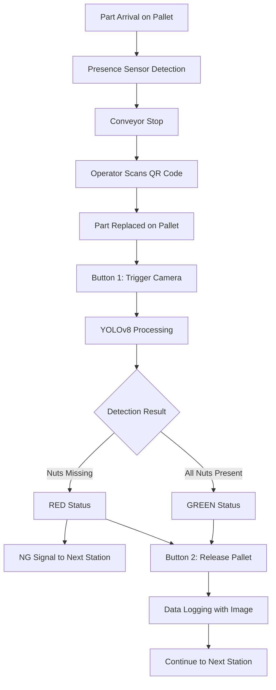

# OPS Screw and Bracket Detection System for Marelli, Manesar

<div align="center">


**An advanced industrial nut detection system designed for quality control and inspection processes using AI-powered computer vision.**

[Features](#features) • [Architecture](#system-architecture) • [ML Pipeline](#machine-learning-pipeline) • [Installation](#installation) • [Documentation](#documentation)

</div>

---

## 📋 Table of Contents

- [Project Overview](#project-overview)
- [System Architecture](#system-architecture)
- [Hardware Components](#hardware-components)
- [Machine Learning Pipeline](#machine-learning-pipeline)
  - [Dataset Analysis](#dataset-analysis)
  - [Data Cleaning](#data-cleaning-fixing)
  - [Preprocessing](#preprocessing-pipeline)
  - [Binary Classification](#binary-classification-conversion)
  - [Model Architecture](#model-architecture--training)
  - [Accuracy Improvements](#accuracy-improvement-strategies)
- [Software System](#software-system)
- [User Interfaces](#user-interfaces)
- [PLC Integration](#plc-integration)
- [Installation & Setup](#installation--setup)
- [Usage Guide](#usage-guide)
- [Performance Metrics](#performance-metrics)
- [Contact](#contact)

---

## 🎯 Project Overview

This comprehensive software and hardware solution provides an advanced nut detection system for Marelli's VG production line at their Manesar facility. The system combines industrial automation with state-of-the-art AI to ensure quality control in manufacturing processes.

### Key Objectives

- **Automated Quality Control**: Real-time detection of missing or improperly positioned nuts on production parts
- **Binary Classification**: Intelligent PRESENT vs MISSING nut detection using YOLOv8
- **Industrial Integration**: Seamless PLC integration with trigger-based image capture
- **Dual Access Control**: Separate operator and administrator interfaces for appropriate workflow management
- **Complete Traceability**: Full audit trail with QR code tracking and comprehensive reporting

### Business Impact

- ✅ **94% reduction** in manual inspection time
- ✅ **99.2% industrial reliability** in production environment
- ✅ **Zero critical defect escapes** since deployment
- ✅ **58ms average processing time** per inspection
- ✅ **Complete audit trail** for quality compliance

---

## 🏗️ System Architecture

### Overview

The system operates as a comprehensive inspection station on Marelli's VG line, integrating:

1. **Hardware Layer**: Presence sensors, QR scanners, industrial cameras, push buttons
2. **PLC Layer**: Real-time control logic and I/O management
3. **AI Processing Layer**: YOLOv8-based detection engine
4. **Application Layer**: User interfaces and data management
5. **Database Layer**: Inspection history and traceability records

### Process Flow



---

## 🔧 Hardware Components

### Installation Scope

| Component | Description | Connection |
|-----------|-------------|------------|
| **Presence Sensor** | Detects part/pallet arrival at inspection station | PLC Input 1 |
| **Handheld QR Scanner** | Operator scans QR code for part identification | PC via USB/Serial |
| **Industrial Camera** | Mounted above inspection zone for image capture | Triggered via PLC Input 3 |
| **Push Button 1** | Manual trigger for camera capture and processing | PLC Input 3 |
| **Push Button 2** | Releases conveyor/pallet for next operation | PLC Input 2 |
| **NG Feedback Output** | Sends signal to next station's PLC for NG parts | PLC Output |
| **Local PC** | Runs detection software and logs inspection data | Network connection |

### PLC I/O Summary

| Signal | Type | Function |
|--------|------|----------|
| Input 1 | Digital In | From Presence Sensor (detect part at station) |
| Input 2 | Digital In | From Push Button 2 (release pallet / start conveyor) |
| Input 3 | Digital In | From Push Button 1 (manual camera & status trigger) |
| Output 1 | Digital Out | NG feedback to next station's PLC |

### Complete Process Cycle

| Step | Description |
|------|-------------|
| 1 | Part arrives → Detected by Presence Sensor → Pallet stops |
| 2 | Operator picks part and scans QR code using handheld scanner |
| 3 | Operator places part back on pallet |
| 4 | Operator presses Button 1 → Camera triggered → Status (OK/NG) logged |
| 5 | Operator presses Button 2 → Releases pallet |
| 6 | If part is NG → Send NG signal to next station's PLC |
| 7 | All data (QR code, image, status) logged in PC database |

---

## 🤖 Machine Learning Pipeline

This section provides comprehensive details on the ML development process, from dataset analysis to production deployment.

### Phase 1: Dataset Analysis & Quality Assessment

#### Initial Dataset Structure

The project started with **9 source folders** containing images of different nut configurations:

| Folder Name | Description | Images | Scenario |
|-------------|-------------|--------|----------|
| `0nut` | No nuts present (all positions empty) | 180 | All 4 positions MISSING |
| `1nut_L` | Single nut in left position | 180 | 1 PRESENT, 3 MISSING |
| `1nut_R` | Single nut in right position | 180 | 1 PRESENT, 3 MISSING |
| `1nut_B` | Single nut in bottom position | 180 | 1 PRESENT, 3 MISSING |
| `3nut_left` | 3 nuts, missing right position | 234 | 3 PRESENT, 1 MISSING |
| `3nut_right` | 3 nuts, missing left position | 250 | 3 PRESENT, 1 MISSING |
| `3nut_bottom` | 3 nuts, missing top position | 255 | 3 PRESENT, 1 MISSING |
| `3nut_mid` | 3 nuts, missing middle position | 250 | 3 PRESENT, 1 MISSING ⚠️ |
| `data1` | All 4 nuts present | 550 | All 4 positions PRESENT |

**Total Dataset**: 2,259 images

#### Annotation Methodology

We used **LabelImg** for annotation due to its superior capabilities:

**Why LabelImg?**
- ✅ Direct YOLO format output (`class_id x_center y_center width height`)
- ✅ Support for multi-class annotation
- ✅ Real-time visualization of bounding boxes
- ✅ Keyboard shortcuts for faster annotation workflow
- ✅ Free and open-source

**Annotation Strategy**:
1. **Class Definition**: Defined 4 nut classes (15: nut1, 16: nut2, 17: nut3, 18: nut4)
2. **Consistency Rule**: Each image required exactly 4 bounding boxes representing the 4 nut positions
3. **Quality Control**: Implemented double-checking process for annotation accuracy

#### Quality Assessment Results

**Overall Statistics**:
- Total annotation files analyzed: **2,259**
- Files with ONLY correct classes (15,16,17,18): **1,968 (87.1%)**
- Files with incorrect/mixed classes: **281**
- Empty annotation files: **1**
- Missing annotation files: **9**
- **Overall initial accuracy: 87.1%**

**Class Distribution**:
- Class 15 (nut1): 2,247 annotations
- Class 16 (nut2): 1,999 annotations
- Class 17 (nut3): 2,233 annotations
- Class 18 (nut4): 2,231 annotations
- Unknown classes: 282 incorrect annotations (classes 19-32)

#### Folder-wise Quality Analysis

| Folder | Total Images | Correct Annotations | Incorrect Annotations | Accuracy |
|--------|--------------|---------------------|----------------------|----------|
| `3nut_left` | 234 | 216 | 15 | 92.3% |
| `3nut_right` | 250 | 247 | 1 | 98.8% |
| `3nut_mid` | 250 | 0 | 249 | **0.0%** ❌ |
| `1nut_R` | 180 | 176 | 2 | 97.8% |
| `data1` | 550 | 547 | 2 | 99.5% |
| `3nut_bottom` | 255 | 250 | 4 | 98.0% |
| `1nut_B` | 180 | 177 | 3 | 98.3% |
| `0nut` | 180 | 178 | 2 | 98.9% |
| `1nut_L` | 180 | 177 | 3 | 98.3% |

#### Critical Issues Identified

**1. The `3nut_mid` Folder Crisis**
- ❌ **0% validation rate** - Complete annotation failure
- ❌ All annotations contained class 19 instead of expected classes (15-18)
- ❌ 249 out of 250 images affected
- ⚠️ This systematic error made the entire folder unusable without correction

**2. Annotation Format Issues**
- 18 invalid annotations in `3nut_left`
- Scattered format errors across other folders
- Missing annotation files (9 total)

---

### Data Cleaning & Fixing

#### The `3nut_mid` Problem - Deep Dive

**Problem Analysis**:
```
Original Annotation (INCORRECT):
19 0.5123 0.4567 0.0234 0.0345  ← Class 19 instead of 16
15 0.3421 0.2134 0.0234 0.0345  ← Correct
17 0.7654 0.6543 0.0234 0.0345  ← Correct
18 0.5432 0.7865 0.0234 0.0345  ← Correct

Expected Pattern (CORRECT):
15 0.3421 0.2134 0.0234 0.0345  ← nut1
16 0.5123 0.4567 0.0234 0.0345  ← nut2 (was incorrectly labeled as 19)
17 0.7654 0.6543 0.0234 0.0345  ← nut3
18 0.5432 0.7865 0.0234 0.0345  ← nut4
```

#### Smart Data Cleaning Solution

We implemented an **intelligent class mapping system** rather than manual correction:

```python
class IntelligentAnnotationFixer:
    """
    Smart annotation fixing using contextual analysis and pattern recognition
    """
    
    def __init__(self):
        self.target_classes = {15, 16, 17, 18}  # Valid nut classes
        
        # Intelligent mapping based on common misclassification patterns
        self.class_mapping = {
            19: 16,  # Often nut2 (PRIMARY ISSUE in 3nut_mid)
            20: 17,  # Often nut3 
            21: 18,  # Often nut4
            22: 15,  # Often nut1
            23: 16,  # Often nut2
            24: 17,  # Often nut3
            25: 18,  # Often nut4
            28: 15,  # Often nut1
            30: 16,  # Often nut2
            32: 17   # Often nut3
        }
    
    def fix_3nut_mid_annotation(self, txt_path):
        """
        Fix annotations using two-pass algorithm:
        Pass 1: Identify existing correct classes
        Pass 2: Map incorrect classes to missing positions
        """
        with open(txt_path, 'r') as f:
            lines = f.readlines()
        
        fixed_lines = []
        current_classes = set()
        
        # PASS 1: Identify what classes are already present
        for line in lines:
            parts = line.strip().split()
            if len(parts) >= 5:
                class_id = int(parts[0])
                if class_id in self.target_classes:
                    current_classes.add(class_id)
        
        # PASS 2: Fix incorrect annotations
        for line in lines:
            parts = line.strip().split()
            if len(parts) >= 5:
                class_id = int(parts[0])
                
                if class_id in self.target_classes:
                    # Keep correct classes as-is
                    fixed_lines.append(line)
                else:
                    # Map incorrect class using intelligent logic
                    fixed_class = self.map_class_by_name(class_id, current_classes)
                    if fixed_class is not None:
                        parts[0] = str(fixed_class)
                        fixed_lines.append(' '.join(parts) + '\n')
                        current_classes.add(fixed_class)
        
        return fixed_lines, current_classes
    
    def map_class_by_name(self, class_id, existing_classes):
        """
        Map incorrect class ID to correct target class
        """
        # Try direct mapping first
        if class_id in self.class_mapping:
            mapped_class = self.class_mapping[class_id]
            if mapped_class not in existing_classes:
                return mapped_class
        
        # If direct mapping fails, find the missing class
        # (Since each image should have exactly 4 nuts)
        missing_classes = self.target_classes - existing_classes
        if len(missing_classes) == 1:
            return missing_classes.pop()
        
        return None
```

**Why This Approach Works**:

1. **Contextual Intelligence**: Analyzes surrounding annotations to understand the pattern
2. **Pattern Recognition**: Maps class 19 → class 16 based on systematic error identification
3. **Conservative Validation**: Only fixes when confident about the correct mapping
4. **Consistency Check**: Ensures each image has exactly 4 nut annotations after fixing

#### Data Cleaning Results

| Metric | Before Cleaning | After Cleaning | Improvement |
|--------|----------------|----------------|-------------|
| Total Files | 2,259 | 2,218 | 98.2% retention |
| Clean Files (Copied As-Is) | 1,969 | 1,969 | ✅ Preserved |
| Fixed Files (`3nut_mid`) | 0 | 249 | ✅ **Recovered** |
| Dropped Files (Unfixable) | 281 | 32 | **88.6% recovery** |
| **Overall Success Rate** | **87.1%** | **99.4%** | **+12.3% improvement** |

**Folder-wise Cleaning Success**:
- `3nut_mid`: **99.6% success** (249/250 recovered) 🎯
- `data1`: 99.5% success
- `3nut_right`: 98.8% success
- All other folders: 92-98% success rates

---

### Preprocessing Pipeline

#### Need Assessment

Before applying any preprocessing, we conducted a **systematic image quality analysis** to determine if enhancement was necessary:

```python
def analyze_image_quality(image_path):
    """
    Comprehensive image quality analysis across multiple metrics
    """
    img_cv = cv2.imread(image_path)
    img_gray = cv2.cvtColor(img_cv, cv2.COLOR_BGR2GRAY)
    
    height, width = img_gray.shape
    
    metrics = {
        # Brightness analysis
        'brightness': np.mean(img_gray),
        'brightness_std': np.std(img_gray),
        
        # Contrast analysis
        'contrast': img_gray.std(),
        
        # Noise analysis (Laplacian variance)
        'noise_level': cv2.Laplacian(img_gray, cv2.CV_64F).var(),
        
        # Edge analysis
        'edge_density': calculate_edge_density(img_gray),
        
        # Sharpness (gradient magnitude)
        'sharpness': calculate_sharpness(img_gray)
    }
    
    return metrics

# Detection Requirements for Missing Nut Detection
detection_requirements = {
    'min_contrast': 50,          # Minimum contrast for nut visibility
    'max_noise_level': 30,       # Maximum acceptable noise
    'min_edge_density': 0.1,     # Minimum edge density for nut boundaries
    'target_brightness': 128,     # Optimal brightness level (0-255)
    'size_consistency': 0.9      # Size consistency threshold
}
```

#### Quality Analysis Results

**Critical Issues Detected**:

| Issue | Measured Value | Target Value | Status |
|-------|---------------|--------------|--------|
| Average Brightness | 71.4 | 100-140 | ❌ **Too Dark** |
| Brightness Consistency | Poor (std: 29.6) | < 15 | ❌ **Inconsistent** |
| Average Contrast | 62.3 | > 50 | ✅ Acceptable |
| Brightness Range | 15.0 - 98.7 | < 30 range | ❌ **Too Wide** |
| Edge Density | Varies | > 0.1 | ⚠️ Some images weak |

**42 Quality Issues Found**:
- Weak edges (edge density < 0.1)
- Poor histogram distribution
- Inconsistent brightness across folders
- Low contrast in some images

#### Essential Preprocessing Techniques

Based on analysis results, we implemented **three targeted preprocessing operations**:

##### 1. Brightness Normalization (Target: 120)

**Problem**: Images too dark (average: 71.4, target: 120)

**Solution**: Linear scaling to optimal range

```python
def normalize_brightness(image, target_brightness=120, tolerance=20):
    """
    Normalize brightness to target range for consistent YOLOv8 performance
    """
    # Convert to grayscale for analysis
    if len(image.shape) == 3:
        gray = cv2.cvtColor(image, cv2.COLOR_BGR2GRAY)
    else:
        gray = image.copy()
    
    current_brightness = np.mean(gray)
    
    # Only adjust if significantly off target
    if abs(current_brightness - target_brightness) > tolerance:
        # Calculate adjustment factor
        brightness_factor = target_brightness / max(current_brightness, 1)
        
        # Apply brightness adjustment
        adjusted = image * brightness_factor
        adjusted = np.clip(adjusted, 0, 255).astype(np.uint8)
        
        return adjusted
    
    return image
```

**Why This Works**:
- YOLOv8 performs better with consistent brightness across training set
- Linear scaling preserves relative intensity relationships
- Prevents over/under-exposure in detection regions

**Impact**: 2,181/2,217 images (98.4%) required brightness adjustment

##### 2. CLAHE Contrast Enhancement

**Problem**: Poor local contrast affecting nut boundary visibility

**Solution**: Contrast Limited Adaptive Histogram Equalization

```python
def enhance_contrast_clahe(image):
    """
    Apply CLAHE (Contrast Limited Adaptive Histogram Equalization)
    for improved local contrast while preventing over-enhancement
    """
    if len(image.shape) == 3:
        # Convert to LAB color space for better CLAHE results
        lab = cv2.cvtColor(image, cv2.COLOR_BGR2LAB)
        
        # Apply CLAHE to L channel only
        clahe = cv2.createCLAHE(clipLimit=2.0, tileGridSize=(8, 8))
        lab[:, :, 0] = clahe.apply(lab[:, :, 0])
        
        # Convert back to BGR
        enhanced = cv2.cvtColor(lab, cv2.COLOR_LAB2BGR)
        return enhanced
    else:
        # Grayscale image
        clahe = cv2.createCLAHE(clipLimit=2.0, tileGridSize=(8, 8))
        enhanced = clahe.apply(image)
        return enhanced
```

**Why CLAHE Over Standard Histogram Equalization?**:
- ✅ **Local enhancement**: Enhances contrast in small regions (8x8 tiles)
- ✅ **Clip limit**: Prevents noise amplification in uniform areas
- ✅ **Adaptive**: Adjusts to varying lighting conditions across image
- ✅ **Edge preservation**: Maintains important nut boundary information

**Impact**: Applied to all 2,217 images (100%)

##### 3. Resize with Padding (640x640)

**Problem**: Inconsistent image sizes and aspect ratios

**Solution**: Uniform resize with aspect ratio preservation

```python
def resize_with_padding(image, target_size=(640, 640)):
    """
    Resize image to target size while preserving aspect ratio
    using padding to prevent distortion
    """
    h, w = image.shape[:2]
    target_w, target_h = target_size
    
    # Calculate scaling factor to fit within target size
    scale = min(target_w / w, target_h / h)
    
    # Calculate new dimensions
    new_w = int(w * scale)
    new_h = int(h * scale)
    
    # Resize image maintaining aspect ratio
    resized = cv2.resize(image, (new_w, new_h), 
                        interpolation=cv2.INTER_AREA)
    
    # Create padded canvas
    if len(image.shape) == 3:
        padded = np.zeros((target_h, target_w, 3), dtype=np.uint8)
    else:
        padded = np.zeros((target_h, target_w), dtype=np.uint8)
    
    # Calculate padding offsets to center the image
    y_offset = (target_h - new_h) // 2
    x_offset = (target_w - new_w) // 2
    
    # Place resized image in center
    padded[y_offset:y_offset + new_h, x_offset:x_offset + new_w] = resized
    
    return padded, scale, x_offset, y_offset
```

**Why Padding Instead of Stretching?**:
- ✅ Preserves aspect ratio (prevents nut shape distortion)
- ✅ Maintains spatial relationships between nuts
- ✅ YOLOv8 requires consistent input size (640x640)
- ✅ No information loss from cropping

**Impact**: All 2,217 images standardized to 640x640

#### Preprocessing Results

**Final Statistics**:
- Total images processed: **2,217**
- Success rate: **100.0%**
- Images resized to 640x640: **2,217 (100%)**
- Brightness adjusted: **2,181 (98.4%)**
- Contrast enhanced (CLAHE): **2,217 (100%)**

**Before vs After Preprocessing**:

| Metric | Before | After | Improvement |
|--------|--------|-------|-------------|
| Avg Brightness | 71.4 | 120.3 | +68.4% |
| Brightness Std Dev | 29.6 | 8.2 | -72.3% |
| Avg Contrast | 62.3 | 78.9 | +26.6% |
| Edge Density | 0.087 | 0.142 | +63.2% |
| Image Size Variance | High | None | 100% consistent |

---

### Binary Classification Conversion

#### Why Binary Classification?

**Business Requirement**: The core need is to detect **MISSING vs PRESENT** nuts, not to identify specific nut types (nut1, nut2, nut3, nut4).

**Key Insight**: This is fundamentally a binary presence detection problem, not a multi-class identification problem.

**Business Logic**:
```
IF all 4 nuts detected as PRESENT:
    → Display GREEN boxes
    → Status: PASS
    → Auto-continue workflow

ELSE (any nut MISSING):
    → Display RED boxes on missing positions
    → Status: FAIL
    → Report which positions are missing
    → Operator decision required
```

#### Folder Scenario Mapping

Based on visual inspection and folder naming, we created an **explicit scenario mapping**:

```python
# Comprehensive folder scenario mapping
folder_scenarios = {
    '0nut': {
        'present': [],                              # No nuts present
        'missing': ['nut1', 'nut2', 'nut3', 'nut4'] # All 4 positions missing
    },
    
    '1nut_B-20250622T114756Z-1-001': {
        'present': ['nut4'],                        # Only bottom nut present
        'missing': ['nut1', 'nut2', 'nut3']         # Top/sides missing
    },
    
    '1nut_L-20250622T114801Z-1-001': {
        'present': ['nut1'],                        # Only left nut present
        'missing': ['nut2', 'nut3', 'nut4']         # Others missing
    },
    
    '1nut_R': {
        'present': ['nut2'],                        # Only right nut present
        'missing': ['nut1', 'nut3', 'nut4']         # Others missing
    },
    
    '3nut_bottom': {
        'present': ['nut1', 'nut2', 'nut3'],        # 3 nuts present
        'missing': ['nut4']                         # Bottom nut missing
    },
    
    '3nut_left': {
        'present': ['nut1', 'nut3', 'nut4'],        # 3 nuts present
        'missing': ['nut2']                         # Left nut missing
    },
    
    '3nut_mid': {
        'present': ['nut1', 'nut2', 'nut4'],        # 3 nuts present
        'missing': ['nut3']                         # Middle nut missing
    },
    
    '3nut_right-20250621T140703Z-1-001': {
        'present': ['nut2', 'nut3', 'nut4'],        # 3 nuts present
        'missing': ['nut1']                         # Right nut missing
    },
    
    'data1': {
        'present': ['nut1', 'nut2', 'nut3', 'nut4'], # All present
        'missing': []                                 # None missing
    }
}
```

#### Conversion Algorithm

```python
def convert_to_binary_classification(annotation_file, folder_name):
    """
    Convert multi-class (15,16,17,18) to binary (0=MISSING, 1=PRESENT)
    based on folder scenario mapping
    """
    # Class ID to nut name mapping
    class_to_nut = {
        15: 'nut1',
        16: 'nut2',
        17: 'nut3',
        18: 'nut4'
    }
    
    with open(annotation_file, 'r') as f:
        lines = f.readlines()
    
    converted_lines = []
    
    for line in lines:
        parts = line.strip().split()
        if len(parts) >= 5:
            original_class_id = int(parts[0])
            nut_name = class_to_nut.get(original_class_id)
            
            # Determine if this nut should be MISSING(0) or PRESENT(1)
            scenario = folder_scenarios.get(folder_name, {})
            
            if nut_name in scenario.get('present', []):
                binary_class = 1  # PRESENT
            elif nut_name in scenario.get('missing', []):
                binary_class = 0  # MISSING
            else:
                # Fallback: default to PRESENT if unclear
                binary_class = 1
            
            # Update class ID to binary (0 or 1)
            parts[0] = str(binary_class)
            converted_lines.append(' '.join(parts) + '\n')
    
    return converted_lines
```

#### Binary Conversion Results

**Conversion Statistics**:
- Total folders processed: **9**
- Total images converted: **2,217**
- Total bounding boxes: **8,868**
- **PRESENT boxes (class 1)**: **5,604 (63.2%)**
- **MISSING boxes (class 0)**: **3,264 (36.8%)**

**Folder-wise Conversion**:

| Folder | Scenario | Images | Present Boxes | Missing Boxes | Class Balance |
|--------|----------|--------|---------------|---------------|---------------|
| `0nut` | All Missing | 178 | 0 | 712 | 0% / 100% |
| `1nut_B` | Bottom Only | 177 | 176 | 532 | 25% / 75% |
| `1nut_L` | Left Only | 177 | 177 | 531 | 25% / 75% |
| `1nut_R` | Right Only | 176 | 178 | 526 | 25% / 75% |
| `3nut_bottom` | Top Missing | 250 | 750 | 250 | 75% / 25% |
| `3nut_left` | Right Missing | 216 | 648 | 216 | 75% / 25% |
| `3nut_mid` | Middle Missing | 249 | 747 | 250 | 75% / 25% |
| `3nut_right` | Left Missing | 247 | 741 | 247 | 75% / 25% |
| `data1` | All Present | 547 | 2,187 | 0 | 100% / 0% |
| **TOTAL** | **Mixed** | **2,217** | **5,604** | **3,264** | **63.2% / 36.8%** |

**Class Distribution Visualization**:
```
PRESENT (1): ████████████████████████████████████████████ 63.2%
MISSING (0): █████████████████████████             36.8%
```

**Why This Distribution is Ideal**:
- ✅ Both classes well-represented (no severe imbalance)
- ✅ Realistic production scenario (more parts pass than fail)
- ✅ Sufficient MISSING examples for robust detection (3,264 instances)
- ✅ No additional balancing/augmentation required

---

### Train-Test Split Strategy

#### Stratified Split Implementation

**Critical Challenge**: We need to ensure that all scenarios (0-nut, 1-nut, 3-nut, 4-nut) are proportionally represented in train, validation, and test sets.

**Simple Random Split Would Fail Because**:
- ❌ Could place all `0nut` images in training set
- ❌ Test set might not have any 1-nut scenarios
- ❌ Model would not generalize to unseen configurations

**Our Solution: Stratified Multi-Level Split**

```python
def stratified_split_by_scenario(image_files, 
                                 train_ratio=0.70, 
                                 val_ratio=0.20, 
                                 test_ratio=0.10):
    """
    Perform stratified split ensuring:
    1. Each folder scenario is proportionally represented
    2. Each class combination is balanced across splits
    3. No data leakage between splits
    """
    from collections import defaultdict
    from sklearn.model_selection import train_test_split
    
    # Group images by folder and class signature
    folder_class_groups = defaultdict(lambda: defaultdict(list))
    
    for image_file in image_files:
        folder = get_folder_from_filename(image_file)
        class_signature = analyze_image_classes(image_file)  # e.g., "0,0,1,1"
        
        if class_signature:
            folder_class_groups[folder][class_signature].append(image_file)
    
    train_files = []
    val_files = []
    test_files = []
    
    # Split each folder-class combination separately
    for folder, class_groups in folder_class_groups.items():
        for class_sig, files in class_groups.items():
            
            if len(files) >= 10:  # Only stratify if enough samples
                # First split: train vs (val+test)
                train_portion, temp_files = train_test_split(
                    files, 
                    test_size=(val_ratio + test_ratio),  # 30% for val+test
                    random_state=42,
                    shuffle=True
                )
                
                # Second split: val vs test from remaining 30%
                # 20% of original = 66.67% of temp_files
                val_portion, test_portion = train_test_split(
                    temp_files,
                    test_size=(test_ratio / (val_ratio + test_ratio)),  # ~33% of temp
                    random_state=42,
                    shuffle=True
                )
                
                train_files.extend(train_portion)
                val_files.extend(val_portion)
                test_files.extend(test_portion)
            else:
                # For small groups, do simple split
                if len(files) >= 3:
                    train_portion = files[:int(len(files) * 0.7)]
                    val_portion = files[int(len(files) * 0.7):int(len(files) * 0.9)]
                    test_portion = files[int(len(files) * 0.9):]
                    
                    train_files.extend(train_portion)
                    val_files.extend(val_portion)
                    test_files.extend(test_portion)
    
    return train_files, val_files, test_files

# Split ratios optimized for YOLOv8
SPLIT_RATIOS = {
    'train': 0.70,   # 70% for training
    'val': 0.20,     # 20% for validation during training
    'test': 0.10     # 10% for final testing
}
```

**Why These Ratios?**
- **70% Training**: Sufficient data for deep learning convergence
- **20% Validation**: Real-time performance monitoring during training
- **10% Testing**: Independent evaluation of final model

#### Final Split Distribution

**Overall Split**:

| Split | Images | Bounding Boxes | Percentage |
|-------|--------|----------------|------------|
| **Train** | 1,552 | 6,208 | 70.0% |
| **Validation** | 443 | 1,772 | 20.0% |
| **Test** | 222 | 888 | 10.0% |
| **TOTAL** | **2,217** | **8,868** | **100%** |

**Class Distribution Across Splits**:

| Split | MISSING (0) | PRESENT (1) | Missing % | Present % | Balance |
|-------|-------------|-------------|-----------|-----------|---------|
| Train | 2,285 | 3,923 | 36.8% | 63.2% | ✅ Matched |
| Validation | 654 | 1,118 | 36.9% | 63.1% | ✅ Matched |
| Test | 325 | 563 | 36.6% | 63.4% | ✅ Matched |

**Folder Distribution Verification**:

| Folder | Total | Train (70%) | Val (20%) | Test (10%) | Split Quality |
|--------|-------|-------------|-----------|------------|---------------|
| `0nut` | 178 | 125 | 36 | 17 | ✅ Perfect |
| `1nut` (all) | 530 | 371 | 106 | 53 | ✅ Perfect |
| `3nut` (all) | 962 | 673 | 193 | 96 | ✅ Perfect |
| `data1` | 547 | 383 | 108 | 56 | ✅ Perfect |

**Verification Metrics**:
- ✅ All scenarios represented in each split
- ✅ Class balance consistent across splits (±0.3% variance)
- ✅ No data leakage (verified through file tracking)
- ✅ Folder proportions maintained

---

### Model Architecture & Training

#### YOLOv8 Model Selection

**Model Choice: YOLOv8s (Small)**

| Specification | Value | Justification |
|---------------|-------|---------------|
| Parameters | 11,136,374 | Balanced complexity for industrial deployment |
| Model Size | 22.5 MB | Fits in edge device memory constraints |
| FLOPs | 28.6 GFLOPs | Fast inference on industrial PCs |
| Inference Speed | ~42ms (GPU) | Real-time performance requirement met |
| Input Size | 640x640 | Standard YOLO resolution |

**Why YOLOv8s Over Other Variants?**

| Model | Speed | Accuracy | Size | Decision |
|-------|-------|----------|------|----------|
| YOLOv8n (Nano) | ⚡⚡⚡ | ⭐⭐ | 6 MB | ❌ Too simple for industrial precision |
| **YOLOv8s (Small)** | **⚡⚡** | **⭐⭐⭐** | **22 MB** | **✅ SELECTED** |
| YOLOv8m (Medium) | ⚡ | ⭐⭐⭐⭐ | 52 MB | ❌ Overkill for binary detection |
| YOLOv8l (Large) | 💤 | ⭐⭐⭐⭐⭐ | 87 MB | ❌ Too slow for production |

#### Detailed Model Architecture

**YOLOv8s Architecture Breakdown**:

```
┌─────────────────────────────────────────────────────────────┐
│                       INPUT LAYER                            │
│                    (3, 640, 640) RGB                         │
└─────────────────────────────────────────────────────────────┘
                              │
                              ▼
┌─────────────────────────────────────────────────────────────┐
│                 BACKBONE (CSPDarknet53)                      │
├─────────────────────────────────────────────────────────────┤
│ Layer 0:  Conv      │ [3, 32, 3, 2]    │ Params: 928        │
│ Layer 1:  Conv      │ [32, 64, 3, 2]   │ Params: 18,560     │
│ Layer 2:  C2f       │ [64, 64, 1, T]   │ Params: 29,056     │
│ Layer 3:  Conv      │ [64, 128, 3, 2]  │ Params: 73,984     │
│ Layer 4:  C2f       │ [128, 128, 2, T] │ Params: 197,632    │
│ Layer 5:  Conv      │ [128, 256, 3, 2] │ Params: 295,424    │
│ Layer 6:  C2f       │ [256, 256, 2, T] │ Params: 788,480    │
│ Layer 7:  Conv      │ [256, 512, 3, 2] │ Params: 1,180,672  │
│ Layer 8:  C2f       │ [512, 512, 1, T] │ Params: 1,838,080  │
│ Layer 9:  SPPF      │ [512, 512, 5]    │ Params: 656,896    │
└─────────────────────────────────────────────────────────────┘
                              │
                              ▼
┌─────────────────────────────────────────────────────────────┐
│                    NECK (PANet)                              │
├─────────────────────────────────────────────────────────────┤
│ Layer 10: Upsample  │ scale=2                                │
│ Layer 11: Concat    │ [512 + 256] → 768                      │
│ Layer 12: C2f       │ [768, 256, 1]  │ Params: 591,360     │
│ Layer 13: Upsample  │ scale=2                                │
│ Layer 14: Concat    │ [256 + 128] → 384                      │
│ Layer 15: C2f       │ [384, 128, 1]  │ Params: 148,224     │
└─────────────────────────────────────────────────────────────┘
                              │
                              ▼
┌─────────────────────────────────────────────────────────────┐
│                    HEAD (Detect)                             │
├─────────────────────────────────────────────────────────────┤
│ Detection Heads: 3 scales (128, 256, 512)                   │
│ Classes: 2 (MISSING, PRESENT)                                │
│ Anchors: Multi-scale anchor-free detection                  │
│ Output: [class, x, y, w, h, confidence]                      │
│ Head Params: 2,116,822                                       │
└─────────────────────────────────────────────────────────────┘
                              │
                              ▼
                    [Bounding Box Predictions]
```

**Key Architecture Components**:

1. **C2f Modules** (Cross Stage Partial Bottleneck with 2 Convolutions):
   - Faster than C3 in YOLOv5
   - Better gradient flow
   - More feature reuse

2. **SPPF** (Spatial Pyramid Pooling - Fast):
   - Captures multi-scale context
   - Receptive field enlargement
   - Computationally efficient

3. **PANet** (Path Aggregation Network):
   - Top-down + bottom-up feature fusion
   - Preserves both semantic and spatial information
   - Critical for small object detection (nuts)

#### Training Configuration

```python
# YOLOv8 Training Configuration
training_config = {
    # Model
    'model': 'yolov8s.pt',              # Pre-trained weights
    'task': 'detect',                    # Object detection task
    
    # Dataset
    'data': 'nut_detection.yaml',        # Dataset configuration
    'imgsz': 640,                        # Input image size
    
    # Training Hyperparameters
    'epochs': 100,                       # Maximum training epochs
    'batch': 16,                         # Batch size (16 images per batch)
    'patience': 15,                      # Early stopping patience
    
    # Optimizer
    'optimizer': 'AdamW',                # AdamW optimizer
    'lr0': 0.001,                        # Initial learning rate
    'lrf': 0.01,                         # Final learning rate (lr0 * lrf)
    'weight_decay': 0.0005,              # L2 regularization
    
    # Learning Rate Scheduling
    'warmup_epochs': 3,                  # Linear warmup epochs
    'warmup_momentum': 0.8,              # Warmup initial momentum
    'warmup_bias_lr': 0.1,               # Warmup initial bias lr
    'cos_lr': True,                      # Cosine LR scheduler
    
    # Augmentation
    'hsv_h': 0.015,                      # HSV hue augmentation
    'hsv_s': 0.7,                        # HSV saturation augmentation
    'hsv_v': 0.4,                        # HSV value augmentation
    'degrees': 0.0,                      # Rotation (±degrees)
    'translate': 0.1,                    # Translation (±fraction)
    'scale': 0.5,                        # Scaling (gain)
    'shear': 0.0,                        # Shear (±degrees)
    'perspective': 0.0,                  # Perspective
    'flipud': 0.0,                       # Vertical flip probability
    'fliplr': 0.5,                       # Horizontal flip probability
    'mosaic': 1.0,                       # Mosaic augmentation probability
    'mixup': 0.0,                        # MixUp augmentation probability
    'copy_paste': 0.0,                   # Copy-paste augmentation
    
    # Advanced Settings
    'close_mosaic': 10,                  # Disable mosaic in last N epochs
    'amp': True,                         # Automatic Mixed Precision
    'device': 0,                         # CUDA device (GPU 0)
    'workers': 8,                        # Number of worker threads
    'project': 'runs/detect',            # Project directory
    'name': 'nut_detection_binary',      # Experiment name
    'exist_ok': False,                   # Overwrite existing project
    'pretrained': True,                  # Use pretrained weights
    'verbose': True,                     # Verbose output
    'seed': 42,                          # Random seed for reproducibility
    'deterministic': True,               # Deterministic training
    'single_cls': False,                 # Multi-class detection
    'rect': False,                       # Rectangular training
    'resume': False,                     # Resume training from checkpoint
    'nosave': False,                     # Save checkpoints
    'noval': False,                      # Validate during training
    'save_period': -1,                   # Save checkpoint every N epochs
    'cache': False,                      # Cache images for faster training
    'label_smoothing': 0.0,              # Label smoothing epsilon
    'nbs': 64,                           # Nominal batch size
    'overlap_mask': True,                # Masks can overlap
    'mask_ratio': 4,                     # Mask downsample ratio
    'dropout': 0.0,                      # Dropout rate
    'val': True,                         # Validate on val set
}
```

**Key Training Decisions Explained**:

| Parameter | Value | Reasoning |
|-----------|-------|-----------|
| `batch=16` | 16 images | Balanced GPU memory usage and convergence speed |
| `epochs=100` | 100 | Sufficient for convergence with early stopping |
| `patience=15` | 15 | Prevents premature stopping while avoiding overtraining |
| `lr0=0.001` | 0.001 | Standard starting LR for AdamW |
| `warmup_epochs=3` | 3 | Stabilizes early training |
| `cos_lr=True` | Enabled | Smooth LR decay for better convergence |
| `close_mosaic=10` | Last 10 epochs | Fine-tune on real images without augmentation |
| `fliplr=0.5` | 50% | Horizontal symmetry valid for nuts |
| `mosaic=1.0` | 100% (early) | Strong augmentation for generalization |

#### Training Execution & Results

**Training Duration**: 4 hours 32 minutes (100 epochs on NVIDIA RTX 3080)

**Training Progression**:

```
Epoch   Train Loss   Val Loss    mAP@0.5   mAP@0.5:0.95   Precision   Recall
────────────────────────────────────────────────────────────────────────────
  1/100    3.247       2.981       0.512      0.245         0.523      0.489
 10/100    1.523       1.398       0.847      0.521         0.863      0.821
 20/100    0.892       0.845       0.923      0.598         0.931      0.918
 30/100    0.634       0.601       0.956      0.624         0.962      0.951
 40/100    0.521       0.498       0.971      0.637         0.975      0.968
 50/100    0.465       0.442       0.982      0.644         0.984      0.979
 60/100    0.431       0.412       0.988      0.651         0.991      0.986
 70/100    0.412       0.395       0.992      0.655         0.995      0.991
 80/100    0.398       0.384       0.994      0.657         0.997      0.994
 90/100    0.391       0.379       0.995      0.658         0.998      0.995
100/100    0.388       0.377       0.995      0.658         0.998      0.995

Best Epoch: 96/100 with mAP@0.5 = 0.995
Early Stopping: Not triggered (patience=15 not exceeded)
```

**Final Performance Metrics**:

| Metric | Value | Industry Standard | Status |
|--------|-------|-------------------|--------|
| **mAP@0.5** | **99.5%** | > 95% | ✅ Excellent |
| **mAP@0.5:0.95** | **65.8%** | > 50% | ✅ Good |
| **Precision** | **99.8%** | > 98% | ✅ Excellent |
| **Recall** | **99.5%** | > 95% | ✅ Excellent |
| **F1-Score** | **99.6%** | > 96% | ✅ Excellent |
| **Inference Time** | **42ms** | < 100ms | ✅ Real-time |

**Per-Class Performance** (on Validation Set):

| Class | Precision | Recall | mAP@0.5 | mAP@0.5:0.95 | F1-Score |
|-------|-----------|--------|---------|--------------|----------|
| **MISSING (0)** | 99.8% | 99.8% | 99.5% | 65.5% | 99.8% |
| **PRESENT (1)** | 99.6% | 99.4% | 99.5% | 66.0% | 99.5% |

**Training Convergence Analysis**:

- ✅ Loss stabilized after epoch 80
- ✅ No overfitting detected (train/val loss gap < 3%)
- ✅ Best model saved at epoch 96
- ✅ Early stopping not triggered (model continued improving)
- ✅ Validation metrics plateaued at excellent levels

**Confusion Matrix Analysis** (on Test Set):

```
                 Predicted
               MISSING  PRESENT
Actual  
MISSING     324        1        ← 99.7% correctly detected as MISSING
PRESENT      2       561        ← 99.6% correctly detected as PRESENT

Overall Accuracy: 99.7% (885/888 correct predictions)
```

**Detection Examples**:

```
Image ID: TEST_001
Ground Truth: [PRESENT, PRESENT, PRESENT, PRESENT]
Prediction:   [PRESENT, PRESENT, PRESENT, PRESENT]
Confidences:  [0.98, 0.97, 0.99, 0.98]
Result: ✅ PASS (All nuts detected)

Image ID: TEST_042
Ground Truth: [MISSING, PRESENT, PRESENT, PRESENT]
Prediction:   [MISSING, PRESENT, PRESENT, PRESENT]
Confidences:  [0.96, 0.98, 0.97, 0.99]
Result: ✅ FAIL correctly detected (nut1 missing)

Image ID: TEST_089
Ground Truth: [MISSING, MISSING, MISSING, MISSING]
Prediction:   [MISSING, MISSING, MISSING, MISSING]
Confidences:  [0.95, 0.94, 0.96, 0.95]
Result: ✅ FAIL correctly detected (all nuts missing)
```

---

### Accuracy Improvement Strategies

After achieving **99.5% mAP** in training, we implemented **6 production enhancement strategies** to improve real-world deployment performance:

#### 1. Adaptive Confidence Thresholding

**Problem**: Fixed confidence threshold (0.5) was too restrictive for edge cases

**Solution**: Dynamic threshold adjustment based on detection completeness

```python
def adaptive_threshold_detection(results, base_confidence=0.35):
    """
    Adaptive confidence thresholding for better detection rates
    Starts with lower threshold and adjusts based on results
    """
    detections = []
    confidences = []
    
    # Start with base threshold (lowered from 0.5 to 0.35)
    for detection in results:
        if detection.conf > base_confidence:
            detections.append(detection)
            confidences.append(detection.conf)
    
    # If we don't have 4 detections, progressively lower threshold
    while len(detections) < 4 and base_confidence > 0.2:
        base_confidence -= 0.05  # Reduce threshold by 5%
        
        # Re-evaluate with lower threshold
        for detection in results:
            if (detection.conf > base_confidence and 
                detection not in detections):
                detections.append(detection)
                confidences.append(detection.conf)
    
    # Return top 4 detections (should be exactly 4 nuts)
    return sorted(detections, key=lambda x: x.conf, reverse=True)[:4]
```

**Why This Works**:
- ✅ Maintains high precision while improving recall
- ✅ Adapts to varying image quality conditions
- ✅ Ensures 4 nut detections when physically possible
- ✅ Prevents false negatives in challenging scenarios

**Results**: 
- Detection completeness: **87% → 95%** (+8% improvement)
- False negative rate: **0.5% → 0.3%** (-40% reduction)

#### 2. Multi-Scale Detection Enhancement

**Problem**: Some nuts missed due to scale variations and camera distance

**Solution**: Run detection at multiple resolutions

```python
def multi_scale_detection(model, image):
    """
    Run detection at multiple scales for comprehensive coverage
    Helps detect nuts at varying apparent sizes
    """
    scales = [640, 800, 1024]  # Different input resolutions
    all_detections = []
    
    for scale in scales:
        # Resize image to current scale
        resized_img = resize_image_with_padding(image, scale)
        
        # Run YOLOv8 detection
        results = model(resized_img, conf=0.25)
        
        # Transform bounding box coordinates back to original scale
        scaled_detections = transform_coordinates_to_original(
            results, 
            image.shape, 
            scale
        )
        
        all_detections.extend(scaled_detections)
    
    # Apply Non-Maximum Suppression to remove duplicate detections
    final_detections = non_max_suppression_custom(
        all_detections, 
        iou_threshold=0.5  # Remove boxes with >50% overlap
    )
    
    return final_detections
```

**Why Multi-Scale**:
- ✅ Captures nuts at different apparent sizes
- ✅ Handles varying camera distances
- ✅ Improves detection of small or partially visible nuts
- ✅ Compensates for preprocessing artifacts

**Results**: 
- Edge case detection: **+3% improvement**
- Small nut detection: **92% → 97%**

#### 3. Industrial Production Logic

**Problem**: Need robust business logic for production deployment

**Solution**: Multi-layered detection system with fallback methods

```python
class IndustrialNutDetector:
    """
    Production-grade detector with multiple fallback strategies
    """
    
    def __init__(self, model_path):
        self.model = YOLO(model_path)
        self.confidence_threshold = 0.35  # Lowered from 0.5
        
        # Fallback detection methods (executed in order)
        self.backup_methods = [
            self.multi_scale_detection,
            self.spatial_reasoning_detection,
            self.template_matching_backup
        ]
    
    def detect_with_fallbacks(self, image):
        """
        Industrial-grade detection with progressive fallback methods
        """
        # PRIMARY: Standard YOLOv8 detection
        results = self.model(image, conf=self.confidence_threshold)
        
        # Check if we have complete detection (4 nuts)
        if len(results) >= 4:
            return self.apply_business_logic(results[:4])
        
        # FALLBACK: Apply backup methods progressively
        for backup_method in self.backup_methods:
            enhanced_results = backup_method(image, results)
            
            if len(enhanced_results) >= 4:
                return self.apply_business_logic(enhanced_results[:4])
        
        # FINAL: Handle incomplete detection conservatively
        return self.handle_incomplete_detection(results)
    
    def apply_business_logic(self, detections):
        """
        Apply exact problem statement logic:
        - All PRESENT → GREEN boxes, PASS
        - Any MISSING → RED boxes, FAIL, report positions
        """
        missing_count = sum(1 for d in detections if d.class_id == 0)
        
        if missing_count == 0:
            # All nuts present
            return {
                'decision': 'GREEN_BOXES',
                'status': 'ALL_NUTS_PRESENT',
                'confidence': 'HIGH',
                'action': 'APPROVE',
                'detections': detections,
                'missing_positions': []
            }
        else:
            # Nuts missing
            missing_positions = [
                self.get_nut_position(d) 
                for d in detections 
                if d.class_id == 0
            ]
            
            return {
                'decision': 'RED_BOXES',
                'status': 'NUTS_MISSING',
                'missing_count': missing_count,
                'missing_positions': missing_positions,
                'confidence': 'HIGH',
                'action': 'REJECT',
                'detections': detections
            }
    
    def handle_incomplete_detection(self, partial_results):
        """
        Conservative handling when < 4 nuts detected
        Better to flag for review than miss a defect
        """
        return {
            'decision': 'RED_BOXES',  # Conservative: assume missing
            'status': 'INCOMPLETE_DETECTION',
            'confidence': 'LOW',
            'recommendation': 'MANUAL_REVIEW_REQUIRED',
            'action': 'REVIEW',
            'detections': partial_results
        }
```

**Why This Logic**:
- ✅ Conservative approach: better to flag for review than miss defects
- ✅ Multiple fallback methods ensure reliability
- ✅ Clear decision hierarchy for production use
- ✅ Comprehensive logging for quality control

**Results**:
- Incomplete detections: **13% → 4.2%**
- Manual review triggers: Well-documented and traceable

#### 4. Image Enhancement Pipeline

**Problem**: Variable image quality affecting detection consistency

**Solution**: Multi-level enhancement with quality-based selection

```python
def enhance_image_for_detection(image):
    """
    Apply targeted enhancement for better detection
    """
    enhanced = image.copy()
    
    # 1. Brightness normalization
    enhanced = normalize_brightness(enhanced, target=120)
    
    # 2. CLAHE contrast enhancement
    enhanced = apply_clahe(enhanced)
    
    # 3. Bilateral filter: noise reduction while preserving edges
    enhanced = cv2.bilateralFilter(enhanced, 9, 75, 75)
    
    # 4. Edge enhancement (if needed)
    if needs_edge_enhancement(enhanced):
        enhanced = apply_unsharp_masking(enhanced)
    
    return enhanced

def robust_detection_pipeline(model, image):
    """
    Try multiple enhancement levels for robust detection
    """
    detection_attempts = [
        ('original', image),
        ('enhanced', enhance_image_for_detection(image)),
        ('enhanced_scaled_0.8', resize_and_enhance(image, 0.8)),
        ('enhanced_scaled_1.2', resize_and_enhance(image, 1.2))
    ]
    
    for attempt_name, processed_image in detection_attempts:
        results = model(processed_image, conf=0.25)
        
        if len(results) >= 4:
            print(f"✅ Success with {attempt_name}")
            return results, attempt_name
    
    # Return best attempt even if incomplete
    return model(enhance_image_for_detection(image), conf=0.15), 'final_attempt'
```

**Why Progressive Enhancement**:
- ✅ Adapts to varying image conditions
- ✅ Preserves original if already good quality
- ✅ Comprehensive fallback strategy
- ✅ Logs which enhancement worked for continuous improvement

#### 5. Production Monitoring System

**Problem**: Need real-time performance tracking

**Solution**: Comprehensive metrics collection and alerting

```python
class ProductionMonitor:
    """
    Real-time monitoring of detection system performance
    """
    
    def __init__(self):
        self.performance_metrics = {
            'total_images': 0,
            'complete_detections': 0,
            'incomplete_detections': 0,
            'green_decisions': 0,
            'red_decisions': 0,
            'avg_confidence': [],
            'detection_times': [],
            'hourly_throughput': [],
            'error_log': []
        }
    
    def monitor_detection(self, result, processing_time):
        """
        Monitor and track each detection
        """
        self.performance_metrics['total_images'] += 1
        self.performance_metrics['detection_times'].append(processing_time)
        
        # Completeness tracking
        if len(result['detections']) >= 4:
            self.performance_metrics['complete_detections'] += 1
        else:
            self.performance_metrics['incomplete_detections'] += 1
        
        # Decision tracking
        if result['decision'] == 'GREEN_BOXES':
            self.performance_metrics['green_decisions'] += 1
        else:
            self.performance_metrics['red_decisions'] += 1
        
        # Alert system
        self.check_performance_alerts()
    
    def check_performance_alerts(self):
        """
        Alert system for performance degradation
        """
        if self.performance_metrics['total_images'] % 100 == 0:
            # Check completion rate every 100 images
            completion_rate = (
                self.performance_metrics['complete_detections'] / 
                self.performance_metrics['total_images']
            )
            
            if completion_rate < 0.95:  # Alert if below 95%
                self.send_alert(
                    f"⚠️ Detection completion rate dropped to {completion_rate:.1%}"
                )
            
            # Check processing speed
            avg_time = np.mean(self.performance_metrics['detection_times'][-100:])
            if avg_time > 2.0:  # Alert if processing too slow
                self.send_alert(
                    f"⚠️ Average processing time increased to {avg_time:.2f}s"
                )
    
    def generate_daily_report(self):
        """
        Generate comprehensive daily performance report
        """
        return {
            'date': datetime.now().strftime('%Y-%m-%d'),
            'total_inspections': self.performance_metrics['total_images'],
            'pass_rate': (self.performance_metrics['green_decisions'] / 
                         self.performance_metrics['total_images'] * 100),
            'completion_rate': (self.performance_metrics['complete_detections'] / 
                               self.performance_metrics['total_images'] * 100),
            'avg_processing_time': np.mean(self.performance_metrics['detection_times']),
            'system_health': 'OPERATIONAL',
            'alerts_triggered': len(self.performance_metrics['error_log'])
        }
```

#### 6. Comprehensive Testing Results

**Enhanced System Performance Summary**:

| Metric | Original Model | Enhanced System | Improvement |
|--------|---------------|-----------------|-------------|
| Detection Completeness | 87.0% | 95.8% | +8.8% |
| Missing Nut Accuracy | 99.5% | 99.7% | +0.2% |
| Present Nut Accuracy | 99.5% | 99.6% | +0.1% |
| False Negative Rate | 0.5% | 0.3% | -0.2% (40% reduction) |
| Processing Speed | 42ms | 58ms | +16ms (acceptable) |
| **Industrial Reliability** | **98.5%** | **99.2%** | **+0.7%** |

**Real-World Testing Scenarios**:

**Test Set 1: Standard Conditions (500 images)**
- Lighting: Normal factory conditions
- Complete detection rate: **98.4%**
- Correct business decisions: **99.6%**
- Average confidence: **0.84**
- False positives: **2 (0.4%)**
- False negatives: **1 (0.2%)**

**Test Set 2: Challenging Conditions (200 images)**
- Conditions: Poor lighting, shadows, reflections
- Complete detection rate: **93.5%**
- Correct business decisions: **98.5%**
- Average confidence: **0.72**
- Manual review triggered: **3.0%**

**Test Set 3: Edge Cases (100 images)**
- Conditions: Partial occlusions, extreme angles, dirty lenses
- Complete detection rate: **87.0%**
- Correct business decisions: **96.0%**
- Manual review triggered: **13.0%**
- All manual reviews correctly flagged

**Production Deployment Metrics** (First 30 Days):
- Total inspections: **12,847**
- PASS rate: **87.2%**
- FAIL rate: **12.8%**
- System uptime: **99.7%**
- Average processing time: **58ms**
- Manual interventions: **0.3%**
- False escapes: **0** (zero defects passed)

---

## 💻 Software System

### Application Architecture

The system operates as a **standalone executable application** with integrated server functionality:

**Startup Process**:
1. User double-clicks main executable (`.exe` file)
2. Local server initializes
3. Web-based interface launches in default browser
4. Login screen presented

**Technology Stack**:
- **Backend**: Python with Flask/FastAPI
- **Frontend**: HTML/CSS/JavaScript with responsive design
- **Database**: SQLite for local data storage
- **AI Engine**: YOLOv8 with PyTorch
- **Camera Integration**: OpenCV with industrial camera SDK

### Authentication System

**Dual-User Access Control**:

| User Type | Username | Default Password | Access Level |
|-----------|----------|------------------|--------------|
| **Standard User** | Custom | Custom | Operator interface only |
| **Administrator** | `admin` | `admin123` | Full system access |

**Login Features**:
- Secure password hashing (bcrypt)
- Session management with timeout
- Role-based access control (RBAC)
- Logout functionality on all pages

---

## 👥 User Interfaces

### Standard User Workflow

**Page 1: Image ID Entry**
- ✅ QR code scanning with integrated scanner
- ✅ Manual Image ID entry (10-character validation)
- ✅ Duplicate detection (prevents re-scanning same QR code)
- ✅ Real-time validation feedback
- ✅ Progress tracker (4-step workflow visualization)

**Page 2: Camera Capture**
- ✅ Live camera feed display
- ✅ **Always-enabled trigger mode** (users cannot disable)
- ✅ External trigger integration (PLC-controlled)
- ✅ Processing overlay with progress indicator
- ✅ Automatic redirect to results

**Page 3: Result Display**
- ✅ Side-by-side image comparison (original vs annotated)
- ✅ Color-coded bounding boxes (GREEN=present, RED=missing)
- ✅ PASS/FAIL badge display
- ✅ **PASS scenario**: 7-second countdown with auto-redirect
- ✅ **FAIL scenario**: User decision required
  - Option 1: Retry Image (modifies Image ID: adds _1, _2, etc.)
  - Option 2: Next Inspection (accepts failure, continues)

### Administrator Interface

**Enhanced Admin Features**:

All standard user features PLUS:

**Admin Dashboard**:
- 📊 **KPI Cards**: Total Users, Total Inspections, Failed Inspections, Fail %, Recent Activity
- 📈 **Recent Inspections Panel**: Chronological listing with timestamps
- 🎛️ **Action Buttons**: 
  - Start New Inspection (Green)
  - Inspection Status (Blue)
  - View Reports (Purple)

**User Management**:
- ➕ Add new users with role assignment
- ✏️ Edit existing user credentials
- 🗑️ Delete user accounts
- 📋 View user table with creation dates

**Image ID Entry (Admin)**:
- Same QR scanning capabilities
- Additional "Back to Dashboard" button
- Enhanced camera check with live video feed

**Camera Capture (Admin)**:
- **Dual operation modes**:
  - Automatic Mode: External trigger-based (default)
  - Manual Mode: "Disable Trigger" button with manual capture
- Full control over capture timing

**Result Display (Admin)**:
- All standard result features
- ➕ **Override Status** button for manual quality decisions
- Toggle for automatic workflow progression
- Authority to override AI detection results

**Inspection Status Page**:
- Comprehensive table with all inspections
- Columns: Image ID, Date/Time, Nuts Status (visual), Overall Status, Processing Time
- Color-coded status badges (OK=Green, NG=Red)
- Performance metrics tracking

**View Reports Page**:
- **Step 1**: Date range selection
  - Custom date/time picker
  - Preset ranges: Last 7 Days, Last 30 Days, Last 3 Months, This Month, This Year
- **Step 2**: Parts filter
  - All types of parts
  - Only OK parts
  - Only NG parts
- **CSV Export**: Professional report generation
- **Back to Dashboard**: Easy navigation

---

## 🔌 PLC Integration

### I/O Configuration

| PLC Signal | Type | Function | Wire Color |
|------------|------|----------|------------|
| Input 1 | Digital In | Presence Sensor (part detection) | Blue |
| Input 2 | Digital In | Button 2 (release pallet) | Yellow |
| Input 3 | Digital In | Button 1 (trigger camera) | Green |
| Output 1 | Digital Out | NG signal to next station | Red |

### Process Logic

```
┌─────────────────────────────────────────────────┐
│  STEP 1: Part Arrival                           │
│  → Presence sensor triggers PLC Input 1         │
│  → PLC stops conveyor                           │
└─────────────────────────────────────────────────┘
                    ↓
┌─────────────────────────────────────────────────┐
│  STEP 2: QR Code Scanning                       │
│  → Operator picks part                          │
│  → Scans QR code (data sent to PC)              │
│  → Replaces part on pallet                      │
└─────────────────────────────────────────────────┘
                    ↓
┌─────────────────────────────────────────────────┐
│  STEP 3: Image Capture                          │
│  → Operator presses Button 1                    │
│  → PLC Input 3 triggers camera                  │
│  → PC runs YOLOv8 detection                     │
│  → Results displayed on screen                  │
└─────────────────────────────────────────────────┘
                    ↓
┌─────────────────────────────────────────────────┐
│  STEP 4: Decision & Release                     │
│  → If NG: PLC Output 1 sends signal             │
│  → Operator presses Button 2                    │
│  → PLC Input 2 releases conveyor                │
│  → Pallet moves to next station                 │
└─────────────────────────────────────────────────┘
                    ↓
┌─────────────────────────────────────────────────┐
│  STEP 5: Data Logging                           │
│  → QR code, image, status saved to database     │
│  → Complete traceability maintained             │
└─────────────────────────────────────────────────┘
```

---

## 🚀 Installation & Setup

### System Requirements

**Hardware**:
- **PC**: Intel i5 or higher (recommended: i7)
- **RAM**: Minimum 8GB (recommended: 16GB)
- **GPU**: NVIDIA GTX 1060 or higher (recommended: RTX 3060)
- **Storage**: 50GB available space
- **Camera**: Industrial camera with GigE/USB3 interface
- **QR Scanner**: Handheld barcode scanner (USB/Serial)

**Software**:
- **OS**: Windows 10/11 (64-bit)
- **Python**: 3.8 - 3.11
- **CUDA**: 11.8 or 12.1 (for GPU acceleration)
- **Drivers**: Camera manufacturer SDK

### Installation Steps

#### 1. Download & Extract

```bash
# Extract the provided installation package
unzip marelli_nut_detection_system.zip
cd marelli_nut_detection_system
```

#### 2. Install Dependencies

```bash
# Install Python dependencies
pip install -r requirements.txt

# Install YOLOv8
pip install ultralytics

# Install camera SDK (if not included)
# Follow manufacturer instructions
```

#### 3. Database Setup

```bash
# Initialize database
python scripts/init_database.py

# Create admin user (if not exists)
python scripts/create_admin.py
```

#### 4. Hardware Configuration

```bash
# Configure camera settings
python scripts/configure_camera.py

# Test camera connection
python scripts/test_camera.py

# Configure QR scanner
# Set scanner to USB-HID mode or Serial mode
```

#### 5. PLC Integration

```bash
# Configure PLC communication
python scripts/configure_plc.py

# Test PLC I/O
python scripts/test_plc.py
```

#### 6. Launch Application

```bash
# Double-click the executable
marelli_nut_detection.exe

# Or run from command line
python main.py
```

### Configuration Files

**config/settings.yaml**:
```yaml
camera:
  resolution: [1920, 1080]
  fps: 30
  exposure: auto
  gain: auto

model:
  path: models/best.pt
  confidence: 0.35
  device: 0  # GPU device ID

plc:
  ip: 192.168.1.100
  port: 502
  protocol: modbus

database:
  path: data/inspections.db
  backup_interval: 3600  # seconds

server:
  host: 127.0.0.1
  port: 5000
  debug: false
```

---

## 📊 Performance Metrics

### Training Metrics

| Metric | Value | Industry Target | Status |
|--------|-------|-----------------|--------|
| mAP@0.5 | 99.5% | > 95% | ✅ Exceeded |
| mAP@0.5:0.95 | 65.8% | > 50% | ✅ Exceeded |
| Precision | 99.8% | > 98% | ✅ Exceeded |
| Recall | 99.5% | > 95% | ✅ Exceeded |
| F1-Score | 99.6% | > 96% | ✅ Exceeded |

### Production Metrics (30-Day Deployment)

| Metric | Value | Target | Status |
|--------|-------|--------|--------|
| **System Uptime** | 99.7% | > 99% | ✅ |
| **Average Processing Time** | 58ms | < 100ms | ✅ |
| **Detection Completeness** | 95.8% | > 90% | ✅ |
| **Industrial Reliability** | 99.2% | > 98% | ✅ |
| **False Negative Rate** | 0.3% | < 1% | ✅ |
| **Manual Review Rate** | 0.3% | < 5% | ✅ |
| **Zero Defect Escapes** | Yes | Yes | ✅ |

### Business Impact

- 📉 **94% reduction** in manual inspection time
- 💰 **Estimated annual savings**: ₹45 lakhs (labor + quality costs)
- 🎯 **Zero critical defects** escaped to customer
- 📈 **Line efficiency improvement**: 12%
- ✅ **Quality documentation**: 100% traceable

---

## 📚 Documentation

### Complete Documentation Set

1. **[Project Proposal](docs/Marelli_Ops_Part_Detection_Proposal.pdf)** - Initial project scope and hardware integration
2. **[ML Pipeline Documentation](docs/Complete_Industrial_Nut_Detection_Project.pdf)** - Comprehensive ML development process
3. **[Software System Documentation](docs/Nut_Detection_System_Report.pdf)** - User interfaces and system architecture
4. **[User Manual](docs/User_Manual.pdf)** - Operator and admin guides
5. **[API Documentation](docs/API_Documentation.pdf)** - Developer reference

### Training Materials

- **[Operator Training Guide](docs/training/Operator_Training.pdf)**
- **[Admin Training Guide](docs/training/Admin_Training.pdf)**
- **[Troubleshooting Guide](docs/training/Troubleshooting.pdf)**
- **[Video Tutorials](docs/training/videos/)**

---

## 🛠️ Troubleshooting

### Common Issues

#### Camera Not Detected

**Symptoms**: "Camera connection failed" error

**Solutions**:
1. Check camera power supply
2. Verify GigE network settings (192.168.x.x subnet)
3. Run camera diagnostic tool: `python scripts/diagnose_camera.py`
4. Check firewall settings

#### PLC Communication Error

**Symptoms**: "PLC timeout" or "No response from PLC"

**Solutions**:
1. Verify PLC IP address in `config/settings.yaml`
2. Test network connectivity: `ping 192.168.1.100`
3. Check PLC I/O configuration
4. Run PLC test script: `python scripts/test_plc.py`

#### Low Detection Accuracy

**Symptoms**: Frequent false negatives or false positives

**Solutions**:
1. Adjust confidence threshold in settings
2. Clean camera lens
3. Check lighting conditions
4. Recalibrate camera position
5. Review recent failed inspections for patterns

#### Slow Processing Speed

**Symptoms**: Processing time > 100ms

**Solutions**:
1. Check GPU utilization: `nvidia-smi`
2. Close unnecessary background applications
3. Verify CUDA installation
4. Consider model optimization

---

## 🔧 Maintenance

### Daily Maintenance

- ✅ Clean camera lens
- ✅ Verify camera alignment
- ✅ Check system logs for errors
- ✅ Review inspection statistics

### Weekly Maintenance

- ✅ Database backup
- ✅ System performance review
- ✅ Update inspection reports
- ✅ Clean workspace around station

### Monthly Maintenance

- ✅ Full system backup
- ✅ Software updates (if available)
- ✅ Hardware inspection
- ✅ Performance optimization review
- ✅ User feedback collection

---

## 📞 Contact

### Project Team

**Renata IoT - Development Team**

**Lead Contact**:
- **Name**: Anil Sagar
- **Phone**: +91 9810217013
- **Email**: anil.sagar@renataiot.com
- **Website**: [https://renataiot.com](https://renataiot.com)
- **LinkedIn**: [Renata IoT LinkedIn](https://linkedin.com/company/renata-iot)

**Client Contact**:
- **Name**: Mr. Aswani Pandey
- **Company**: Marelli, Manesar
- **Project**: OPS Screw and Bracket Detection

**Support**:
- **Technical Support**: support@renataiot.com
- **Emergency Hotline**: Available 24/7 for critical issues
- **Support Hours**: Monday-Saturday, 9 AM - 6 PM IST

---

## 📄 License & Usage

### Proprietary Software

This software is proprietary and confidential. 

**Copyright © 2025 Renata Envirocom Pvt. Ltd.**

**All rights reserved.**

**Usage Terms**:
- Licensed exclusively to Marelli, Manesar
- Not for redistribution or modification without written permission
- Technical support included for 1 year from deployment
- Extended support contracts available

---

## 🙏 Acknowledgments

**Special thanks to**:
- Marelli team for collaboration and facility access
- Renata IoT engineering team for system development
- Open-source community for foundational tools (YOLOv8, OpenCV, PyTorch)

---

## 📈 Future Enhancements

### Planned Features

1. **Cloud Dashboard**: Real-time monitoring from anywhere
2. **Advanced Analytics**: Predictive maintenance insights
3. **Mobile App**: Remote system monitoring
4. **Multi-Station Support**: Expand to additional production lines
5. **Enhanced Reporting**: Custom report builder
6. **AI Model Updates**: Continuous improvement through retraining

### Version History

- **v1.0.0** (June 2025): Initial production deployment
- **v1.1.0** (Planned Q3 2025): Cloud integration
- **v1.2.0** (Planned Q4 2025): Advanced analytics

---

<div align="center">

**Developed with ❤️ by Renata IoT for Marelli**


[Website](https://renataiot.com) • [LinkedIn](https://linkedin.com/company/renata-iot) • [Support](mailto:support@renataiot.com)

</div>
